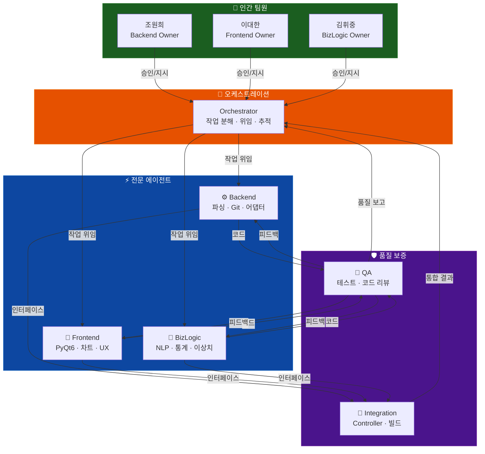
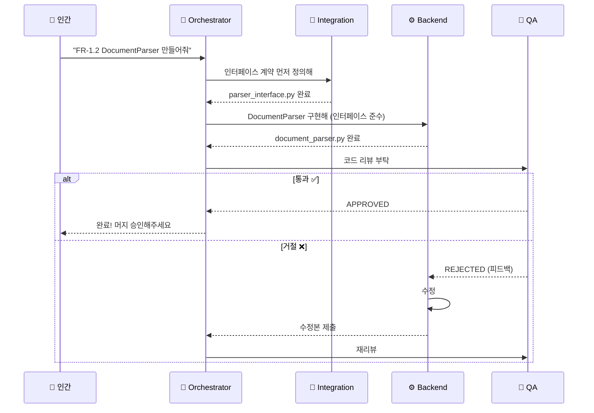
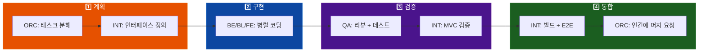

# 🤖 QCE 멀티 에이전트 AI 개발 환경

> AI 에이전트 6마리가 분업해서 QCE를 만든다. 단, 만들어진 앱 자체에는 AI가 안 들어간다.

---

| 버전 | 작성일 | 상위 문서 |
|---|---|---|
| 1.0 | 2026-05-27 | [SRS.md](file:///c:/coding/Software_Engineering/final_project/SRS.md) |

---

> [!IMPORTANT]
> **AI는 "개발 도구"로만 쓴다**
>
> AI 에이전트는 코드를 짜고, 리뷰하고, 테스트를 만드는 **개발 과정**에서만 활용된다.
> 완성된 QCE 앱 자체는 SRS에 명시된 대로 **No AI / No Cloud**를 엄격히 지킨다.
> 최종 .exe 파일에 AI 관련 패키지는 1바이트도 포함되지 않는다.

---

## 한 줄 요약

프로젝트의 MVC 3계층(Model/View/Controller)에 각각 전문 AI 에이전트를 배치하고, 이들을 지휘하는 오케스트레이터 + 품질을 잡는 QA/통합 에이전트까지 총 **6마리의 에이전트가 협업**한다.

---

## 🗺️ 전체 구조



**계층 요약:**

| 레벨 | 누구 | 역할 |
|---|---|---|
| **L0 — 인간** | 조원희, 이대한, 김휘중 | 최종 결정, 머지 승인 |
| **L1 — 지휘** | Orchestrator | 작업 쪼개기, 에이전트에 배분, 진행 추적 |
| **L2 — 실행** | Backend, Frontend, BizLogic | 담당 영역 코드 작성 |
| **L3 — 검증** | QA, Integration | 리뷰, 테스트, MVC 검증, 빌드 |

---

## 왜 에이전트를 여러 마리 쓰나?

| 단일 에이전트의 문제 | 멀티 에이전트의 해결 |
|---|---|
| 전체 코드를 한 번에 다 이해하기 어려움 | 각자 담당 영역에만 집중 |
| UI 전문성과 NLP 전문성을 동시에 요구 | 전문 분야별 에이전트 배치 |
| 코드 쓴 사람이 리뷰하면 편향 발생 | 작성(전문 에이전트) ≠ 리뷰(QA) 분리 |
| 순차 작업으로 느림 | 병렬 작업 가능 |

---

## 6마리 에이전트 상세

### 🎯 1. Orchestrator — 총괄 지휘관

| 항목 | 내용 |
|---|---|
| **ID** | `AGT-ORC` |
| **담당 MVC** | 전 계층 (cross-cutting) |
| **인간 파트너** | 전원 (공동) |

**하는 일:**
- SRS 요구사항을 **구현 가능한 작은 태스크**로 쪼갠다
- 적절한 전문 에이전트에 **작업을 배분**한다
- 진행 상태를 추적하고, **병목이나 충돌을 해결**한다
- 결정이 필요한 사안을 **인간 팀원에게 보고**한다

**안 하는 일:**
- ❌ 프로덕션 소스 코드 직접 작성
- ❌ 아키텍처 결정 독단 (인간 승인 필수)

---

### ⚙️ 2. Backend Agent — 데이터 파싱 전문가

| 항목 | 내용 |
|---|---|
| **ID** | `AGT-BE` |
| **담당 MVC** | Model (데이터 파싱 계층) |
| **인간 파트너** | 조원희 |
| **담당 SRS** | FR-1.1, FR-1.2, FR-2.1, FR-3.1, NFR-2.x |

**만드는 코드:**

```
src/model/parsers/
├── document_parser.py    ← .pptx/.docx 파싱
├── git_analyzer.py       ← Git 로그 파싱
└── __init__.py

src/model/adapters/
├── base_adapter.py       ← 어댑터 추상 클래스
├── kakao_adapter.py      ← 카카오톡 포맷 변환
├── slack_adapter.py      ← 슬랙 포맷 변환
├── adapter_factory.py    ← 어댑터 자동 선택 팩토리
└── __init__.py

src/model/security/
├── token_manager.py      ← 토큰 메모리 전용 관리
├── data_sanitizer.py     ← 종료 시 데이터 파기
└── __init__.py
```

**규칙:**
- ❌ `src/view/` 파일 수정 금지
- ❌ 네트워크 호출 코드 작성 금지
- ✅ 새 어댑터는 `BaseAdapter` 상속 + `AdapterFactory` 등록 (OCP)
- ✅ 모든 public 메서드에 type hint + docstring

---

### 🎨 3. Frontend Agent — UI/시각화 전문가

| 항목 | 내용 |
|---|---|
| **ID** | `AGT-FE` |
| **담당 MVC** | View 계층 |
| **인간 파트너** | 이대한 |
| **담당 SRS** | FR-1.1, FR-1.3, FR-2.2(UI), FR-5.1~5.4 |

**만드는 코드:**

```
src/view/
├── main_window.py              ← 메인 화면 + Drag & Drop
├── alias_mapping_view.py       ← 신원 매핑 UI
├── dashboard_view.py           ← 시각화 대시보드
├── warning_panel.py            ← 조기 경보 UI
├── stopwords_editor_view.py    ← 불용어 편집 UI
├── widgets/
│   ├── pie_chart_widget.py     ← 🥧 파이 차트
│   ├── scatter_plot_widget.py  ← 🔵 산점도
│   ├── timeline_widget.py      ← 📈 타임라인
│   ├── radar_chart_widget.py   ← 🕸️ 레이더
│   └── __init__.py
├── styles/
│   └── theme.py                ← 색상/폰트 테마
└── __init__.py
```

**규칙:**
- ❌ `src/model/` 직접 임포트 금지 — 데이터는 Controller 경유
- ❌ View에서 비즈니스 로직 수행 금지
- ✅ 위젯은 재사용 가능한 독립 컴포넌트로 분리
- ✅ 경고 팀원은 붉은색(`#E53935`) + ⚠️ 아이콘

---

### 🧠 4. Business Logic Agent — NLP/통계 전문가

| 항목 | 내용 |
|---|---|
| **ID** | `AGT-BL` |
| **담당 MVC** | Model (비즈니스 로직 계층) |
| **인간 파트너** | 김휘중 |
| **담당 SRS** | FR-1.3, FR-2.2, FR-3.2, FR-4.1~4.3 |

**만드는 코드:**

```
src/model/logic/
├── alias_mapper.py             ← 닉네임 → 팀원 매핑 로직
├── early_warning_engine.py     ← 커밋 이상 탐지 규칙
├── contribution_engine.py      ← 매트릭스 + IF + Z-Score
└── __init__.py

src/model/nlp/
├── nlp_filter.py               ← KoNLPy + 불용어 필터링
├── stopwords_manager.py        ← 불용어 CRUD
└── __init__.py

resources/stopwords/
└── default_stopwords.json      ← 기본 불용어 사전
```

**규칙:**
- ❌ `src/view/` 수정 금지
- ❌ 외부 LLM API 호출 금지
- ✅ Backend가 파싱한 결과를 인터페이스로만 소비
- ✅ 모든 통계 함수는 pandas DataFrame 입출력
- ✅ Z-Score 임계값 기본 -1.5, 2개 이상 하위 시 이상치 판정
- ✅ 경보 임계값: EW-01 ≥ 1,000줄, EW-02 ≥ 팀 평균 × 3 (24h)

---

### 🧪 5. QA Agent — 품질 경찰

| 항목 | 내용 |
|---|---|
| **ID** | `AGT-QA` |
| **담당 MVC** | 전 계층 횡단 |
| **인간 파트너** | 전원 |
| **담당 SRS** | NFR-3.x, NFR-4.3, NFR-4.4 |

**하는 일:**
- 전문 에이전트가 짠 코드에 대한 **pytest 테스트 자동 생성**
- **코드 리뷰** (MVC 위반, 보안, SRS 충족 여부)
- **보안 감사** (네트워크 호출, 토큰 저장 등)
- **성능 테스트** (NFR-3.x 기준값 검증)
- **Docstring/Type Hint** 존재 여부 확인

**만드는 코드:**

```
tests/
├── unit/
│   ├── model/        ← 파서, NLP, 통계 테스트
│   ├── view/         ← UI 위젯 렌더링 테스트
│   └── controller/   ← 컨트롤러 테스트
├── integration/      ← 전체 파이프라인 E2E
├── security/         ← 네트워크 호출 0건 확인, 데이터 파기 확인
└── conftest.py       ← 공통 fixture
```

**코드 리뷰 체크리스트:**

| # | 검사 항목 | 심각도 |
|---|---|---|
| CR-01 | MVC 계층 위반 (View → Model 직접 임포트) | 🔴 머지 차단 |
| CR-02 | 네트워크 호출 존재 (`requests`, `urllib` 등) | 🔴 머지 차단 |
| CR-03 | OAuth Token 디스크 저장 | 🔴 머지 차단 |
| CR-04 | Type hint 누락 | 🟡 경고 |
| CR-05 | Docstring 누락 | 🟡 경고 |
| CR-06 | 매직 넘버 하드코딩 | 🟡 경고 |
| CR-07 | Model 테스트 커버리지 80% 미달 | 🟠 주의 |
| CR-08 | DataFrame I/O 규격 불일치 | 🟠 주의 |
| CR-09 | 어댑터가 BaseAdapter 미상속 | 🟠 주의 |

**규칙:**
- ✅ `tests/` 디렉토리에만 파일 생성
- ❌ 프로덕션 코드 직접 수정 금지
- 🔴 CR-01~03은 **머지 차단** — 고칠 때까지 통과 불가

---

### 🔗 6. Integration Agent — 접착제 + 빌드 담당

| 항목 | 내용 |
|---|---|
| **ID** | `AGT-INT` |
| **담당 MVC** | Controller 계층 + 빌드 |
| **인간 파트너** | 전원 |
| **담당 SRS** | NFR-4.1, NFR-4.2, 빌드/패키징 |

**하는 일:**
- **Controller 구현**: View ↔ Model 사이 중재 (이벤트 라우팅, 데이터 변환)
- **인터페이스 계약 정의**: Backend/BizLogic/Frontend 간 데이터 교환 형식 (ABC/Protocol)
- **MVC 의존성 검증**: `View → Controller → Model` 방향 위반 없는지 정적 분석
- **빌드 파이프라인**: PyInstaller/Nuitka .exe 패키징 스크립트
- **E2E 통합 테스트** 조율

**만드는 코드:**

```
src/controller/
├── app_controller.py      ← MVC Controller

src/interfaces/
├── parser_interface.py    ← IDocumentParser, IGitAnalyzer
├── adapter_interface.py   ← IBaseAdapter
├── analysis_interface.py  ← IContributionEngine, IEarlyWarning
├── view_interface.py      ← IDataReceiver
└── __init__.py

build/
├── build_exe.py           ← PyInstaller 빌드 스크립트
├── build_config.spec      ← PyInstaller spec

scripts/
├── check_mvc_deps.py      ← MVC 의존성 정적 분석
├── check_banned_imports.py ← AI/네트워크 패키지 탐지
└── run_all_tests.sh       ← 전체 테스트 실행
```

**인터페이스 계약 예시:**

```python
# src/interfaces/parser_interface.py
class IDocumentParser(ABC):
    """OOXML 파싱 결과 인터페이스"""

    @abstractmethod
    def parse(self, file_path: str) -> pd.DataFrame:
        """반환: columns=['author', 'byte_modified', 'pages', 'words']"""
        ...

class IGitAnalyzer(ABC):
    """Git 로그 분석 결과 인터페이스"""

    @abstractmethod
    def analyze(self, repo_path: str) -> pd.DataFrame:
        """반환: columns=['author', 'date', 'additions', 'deletions',
                         'files_changed', 'commit_hash']"""
        ...
```

---

## 📬 에이전트 간 소통 방식

### 메시지 종류

| 타입 | 누가 → 누구에게 | 용도 |
|---|---|---|
| `TASK_ASSIGN` | Orchestrator → 전문 에이전트 | "이거 구현해" |
| `TASK_COMPLETE` | 전문 에이전트 → Orchestrator | "다 했어" |
| `CODE_REVIEW` | QA → 전문 에이전트 | "리뷰 결과: 통과/거절 + 피드백" |
| `FEEDBACK` | 에이전트 ↔ 에이전트 | 기술 질문/답변 |
| `INTERFACE_CHANGE` | Integration → 전체 | "인터페이스 바뀌었으니 적응해" |
| `ESCALATION` | 아무나 → Orchestrator → 인간 | "사람이 결정해야 해" |
| `BUILD_RESULT` | Integration → Orchestrator | "빌드 성공/실패" |

### 소통 규칙

| # | 규칙 |
|---|---|
| 1 | 전문 에이전트끼리 직접 작업 위임 **금지** — 반드시 Orchestrator 경유 |
| 2 | 인터페이스 변경 시 **영향 받는 에이전트 전원에게 동시 알림** |
| 3 | QA가 거절(REJECT)하면 해당 에이전트는 **수정 후 재제출 필수** |
| 4 | 모든 메시지에 **SRS 요구사항 ID 첨부** (예: "FR-1.2 관련") |

### 소통 흐름 예시



---

## 🔄 작업 파이프라인

### 새 기능 만들기 (4단계)



| 단계 | 참여자 | 결과물 | 다음으로 넘어가려면 |
|---|---|---|---|
| **1 — 계획** | ORC + INT | 태스크 목록, 인터페이스 파일 | 인간 승인 |
| **2 — 구현** | BE + FE + BL | `src/` 소스 코드 | 각자 완료 선언 |
| **3 — 검증** | QA + INT | 테스트 코드, 리뷰 리포트 | 모든 Critical 통과 |
| **4 — 통합** | INT + ORC | 빌드 파일, E2E 결과 | 인간 머지 승인 |

### 버그 고치기

```
버그 발견 → ORC: 원인 분석 → 담당 에이전트: 패치 → QA: 리뷰+회귀 테스트 → INT: 빌드 → 인간: 머지
```

### 인터페이스 바꾸기

```
변경 요청 → INT: 계약 수정 → 전원에 알림 → 각자 코드 수정 → QA: 전체 테스트 → INT: 빌드 → 인간: 머지
```

---

## 🔐 안전장치

### 앱에 AI가 절대 안 들어가게 하는 장치

| 장치 | 어떻게 | 누가 검증 |
|---|---|---|
| **금지 임포트 리스트** | `openai`, `anthropic`, `transformers`, `langchain` 등 import 시 빌드 차단 | QA + INT |
| **네트워크 호출 탐지** | `requests`, `urllib`, `httpx`, `socket` 등 사용 시 차단 | QA |
| **requirements.txt 감사** | AI 패키지가 의존성에 포함되면 빌드 실패 | INT |
| **Air-Gap 테스트** | 인터넷 끊고 전체 기능 동작 확인 | QA |

### 에이전트 권한 매트릭스 (누가 어디를 건드릴 수 있나)

| 에이전트 | `model/parsers/` | `model/logic/` | `model/nlp/` | `view/` | `controller/` | `interfaces/` | `tests/` | `build/` |
|---|---|---|---|---|---|---|---|---|
| ⚙️ Backend | ✏️ | 👁️ | 👁️ | 👁️ | 👁️ | 👁️ | — | — |
| 🎨 Frontend | 👁️ | 👁️ | 👁️ | ✏️ | 👁️ | 👁️ | — | — |
| 🧠 BizLogic | 👁️ | ✏️ | ✏️ | 👁️ | 👁️ | 👁️ | — | — |
| 🧪 QA | 👁️ | 👁️ | 👁️ | 👁️ | 👁️ | 👁️ | ✏️ | — |
| 🔗 Integration | 👁️ | 👁️ | 👁️ | 👁️ | ✏️ | ✏️ | 👁️ | ✏️ |
| 🎯 Orchestrator | 👁️ | 👁️ | 👁️ | 👁️ | 👁️ | 👁️ | 👁️ | 👁️ |

> ✏️ = 쓰기 가능, 👁️ = 읽기만, — = 접근 불가

### 인간이 반드시 결정해야 하는 것들

| 게이트 | 언제 | 누가 승인 |
|---|---|---|
| 인터페이스 계약 확정 | `src/interfaces/` 변경 시 | 전원 |
| 코드 머지 | PR 머지 시 | 해당 계층 담당자 |
| 아키텍처 변경 | MVC 구조/스택 변경 시 | 전원 |
| 릴리즈 빌드 | .exe 배포 전 | 전원 |

### 에이전트가 고장났을 때

| 상황 | 어떻게 복구 |
|---|---|
| 에이전트가 5분 이상 무응답 | 같은 에이전트에 재위임 or 인간에 알림 |
| QA 거절 3번 연속 | 인간에 에스컬레이션 |
| MVC 위반 감지 | 해당 에이전트에 수정 요청 (머지 차단) |
| 빌드 실패 | 에러 로그를 관련 에이전트에 전달 → 수정 → 재빌드 |

---

## 📁 SRS ↔ 에이전트 매핑

> "이 기능은 어떤 에이전트가 만들고, 어떤 에이전트가 검증하나?"

| SRS ID | 무엇 | 만드는 에이전트 | 검증 |
|---|---|---|---|
| FR-1.1 | Drag & Drop 업로드 | 🎨 FE + ⚙️ BE | 🧪 QA |
| FR-1.2 | OOXML 파싱 | ⚙️ BE | 🧪 QA |
| FR-1.3 | 신원 매핑 | 🎨 FE(UI) + 🧠 BL(로직) | 🧪 QA |
| FR-2.1 | Git 정량 평가 | ⚙️ BE | 🧪 QA |
| FR-2.2 | 조기 경보 | 🧠 BL(규칙) + 🎨 FE(UI) | 🧪 QA |
| FR-3.1 | 대화 포맷 감지 | ⚙️ BE | 🧪 QA |
| FR-3.2 | NLP 필터링 | 🧠 BL | 🧪 QA |
| FR-4.1~4.3 | 통계 + 이상치 탐지 | 🧠 BL | 🧪 QA |
| FR-5.1~5.4 | 시각화 리포트 | 🎨 FE | 🧪 QA |
| NFR-1 | No AI/Cloud | 전원 (준수) | 🧪 QA (감사) |
| NFR-2 | 보안 | ⚙️ BE (구현) | 🧪 QA (감사) |
| NFR-3 | 성능 | 전원 | 🧪 QA (테스트) |
| NFR-4.1 | MVC 단방향 | 전원 | 🔗 INT (검증) |
| NFR-4.2 | 어댑터 OCP | ⚙️ BE | 🔗 INT + 🧪 QA |
| NFR-4.3 | 테스트 80%+ | — | 🧪 QA |
| NFR-4.4 | Docstring 필수 | 전원 | 🧪 QA |

---

## 📂 최종 프로젝트 구조

```
qce/
├── SRS.md                          # 📄 요구사항 명세서
├── Agent.md                        # 🤖 이 문서 (에이전트 환경)
├── README.md
├── requirements.txt
│
├── src/
│   ├── main.py                     # 앱 시작점
│   │
│   ├── interfaces/                 # 🔗 INT: 계층 간 데이터 계약
│   │   ├── parser_interface.py
│   │   ├── adapter_interface.py
│   │   ├── analysis_interface.py
│   │   └── view_interface.py
│   │
│   ├── model/
│   │   ├── parsers/                # ⚙️ BE: 데이터 파싱
│   │   │   ├── document_parser.py
│   │   │   └── git_analyzer.py
│   │   ├── adapters/               # ⚙️ BE: 메신저 포맷 변환
│   │   │   ├── base_adapter.py
│   │   │   ├── kakao_adapter.py
│   │   │   ├── slack_adapter.py
│   │   │   └── adapter_factory.py
│   │   ├── logic/                  # 🧠 BL: 비즈니스 로직
│   │   │   ├── alias_mapper.py
│   │   │   ├── early_warning_engine.py
│   │   │   └── contribution_engine.py
│   │   ├── nlp/                    # 🧠 BL: NLP 처리
│   │   │   ├── nlp_filter.py
│   │   │   └── stopwords_manager.py
│   │   └── security/              # ⚙️ BE: 보안
│   │       ├── token_manager.py
│   │       └── data_sanitizer.py
│   │
│   ├── view/                       # 🎨 FE: PyQt6 UI
│   │   ├── main_window.py
│   │   ├── alias_mapping_view.py
│   │   ├── dashboard_view.py
│   │   ├── warning_panel.py
│   │   ├── stopwords_editor_view.py
│   │   ├── widgets/
│   │   │   ├── pie_chart_widget.py
│   │   │   ├── scatter_plot_widget.py
│   │   │   ├── timeline_widget.py
│   │   │   └── radar_chart_widget.py
│   │   └── styles/
│   │       └── theme.py
│   │
│   └── controller/                 # 🔗 INT: MVC Controller
│       └── app_controller.py
│
├── tests/                          # 🧪 QA: 테스트
│   ├── unit/
│   ├── integration/
│   ├── security/
│   └── conftest.py
│
├── resources/
│   └── stopwords/
│       └── default_stopwords.json
│
├── build/                          # 🔗 INT: 빌드
│   ├── build_exe.py
│   └── build_config.spec
│
└── scripts/                        # 🔗 INT: 유틸리티
    ├── check_mvc_deps.py
    ├── check_banned_imports.py
    └── run_all_tests.sh
```

---

> 이 문서는 QCE 멀티 에이전트 개발 환경의 공식 명세서입니다.
> [SRS.md](file:///c:/coding/Software_Engineering/final_project/SRS.md)와 함께 프로젝트의 핵심 문서로 기능합니다.
