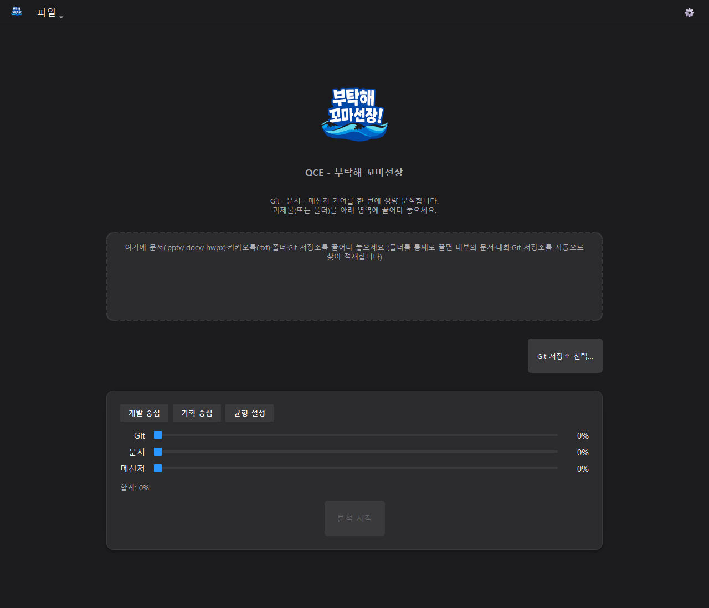
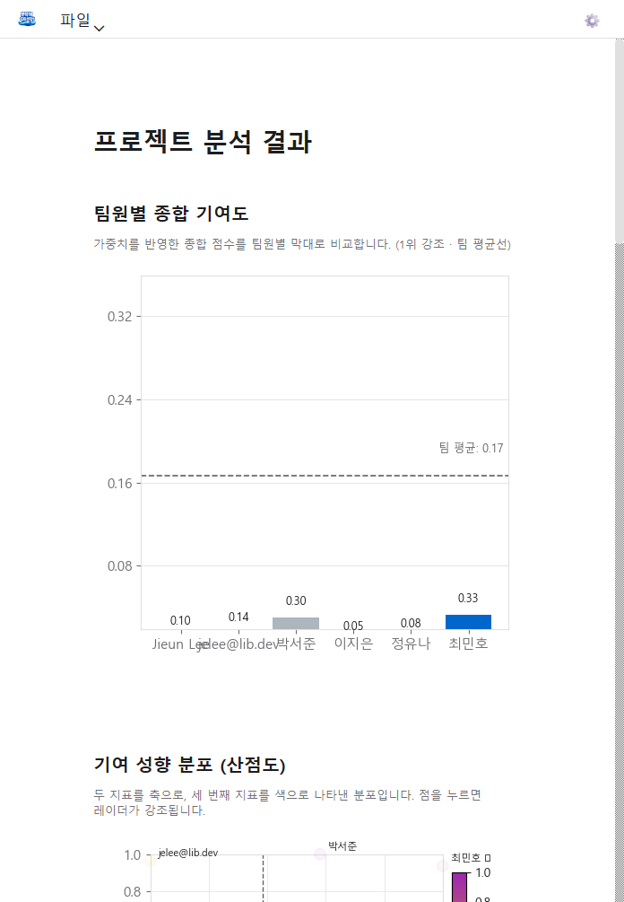

# 🚢 QCE (부탁해 꼬마선장!)

**"우리 배의 방향은 내가 잡는다!" Windows 전용 Python 데스크톱 팀 기여도 정량평가 앱**

*(BGM: 사카낙션 - 밤의 무희)* 🎶

인도네시아 전통 보트 경주 '파추 잘루르(Pacu Jalur)' 영상 속, 보트 맨 앞에서 리듬에 맞춰 독특한 지휘 춤을 추며 노 젓는 선원들의 사기를 올리고 타이밍을 맞추던 **'꼬마선장'** 밈을 아시나요? 
험난한 파도와 같은 대학 팀 프로젝트라는 항해 속에서, **QCE(Quantitative Contribution Evaluator)**는 조장님을 위해 기꺼이 여러분 팀의 '꼬마선장'이 되어 줍니다!

누가 묵묵히 노를 가장 열심히 젓고 있는지, 혹시 땀 흘리는 척만 하는 무임승차 선원은 없는지 파악해야 한다고요? 조장님의 주관적 평가로 인한 팀원들과의 갈등이 걱정되신다고요? 
이제 걱정 마세요. 꼬마선장이 객관적인 데이터로 모든 것을 증명해 줍니다. 무임승차 선원은 절대 꼬마선장의 매의 눈을 피할 수 없습니다! 🕺💃

---

## 📸 꼬마선장의 항해 뷰 (작동 화면)

### 1. 출항 준비 (제출 화면)
조장님이 평가에 사용할 데이터 파일들을 뱃전에 싣는 화면입니다. 문서(.pptx, .docx, .hwpx), 카카오톡 대화 내용(.txt), Git 저장소를 드래그 앤 드롭으로 쉽게 적재할 수 있습니다. 
하단의 가중치 슬라이더를 조절해 우리 배가 '개발' 위주인지, '기획' 위주인지 항해 방향(가중치)을 설정할 수 있습니다!

### 2. 항해 일지 분석 (결과 화면)
선원(팀원)들의 기여도를 분석하여 막대 차트, 레이더 차트, 산점도로 화려하게 시각화해 줍니다! 우측에는 꼬마선장이 찾아낸 '어뷰징 의심 신호'나 '특이 사항'이 경고 카드로 띄워집니다. 각 차트에 마우스를 올리면 평가의 투명성을 위한 낱낱의 원시 데이터(추가된 코드 라인 수, 유효 대화 글자 수 등)도 함께 확인할 수 있습니다.

---

## 🌊 꼬마선장의 핵심 능력 (주요 구현 내용)

- **🚣‍♂️ 삼위일체 통합분석 (단일 파이프라인):** 
  분산된 협업 채널들 때문에 피곤하셨죠? QCE는 **Git 커밋 로그(코드 양)**, **OOXML 및 HWPX 문서 메타데이터(타건량)**, **카카오톡 메신저 활동량(유효 발화 글자 수)**을 한 번에 통합 분석합니다.

- **🕵️‍♂️ 어뷰징 원천 차단 (이상 신호 탐지):** 
  AI 생성 코드를 복붙해서 꼼수를 부리는 선원? 꼬마선장 앞에서는 어림없습니다. 
  `Capping` 기법으로 단일 커밋의 반영 한도를 50,000줄로 제한하고, 로그 스케일링(Log Scaling)을 적용해 기여도 왜곡을 막습니다. 동시에 마감일에만 폭발적으로 커밋하는 행위나(Burst Commit), 전체 평균치에서 지나치게 밑도는 기여도(Z-Score 하위)를 식별해 조장님께 은밀한 '이상 신호' 카드로 귀띔해 줍니다. 

- **📊 춤추는 시각화와 투명한 리포트 (UI/UX):** 
  딱딱한 엑셀은 그만! PyQt6 기반의 3-스크린 셸 아키텍처 위에서 matplotlib 기반의 부드러운 애니메이션 차트를 제공합니다. 막대, 레이더, 산점도 3종 차트로 기여도를 다각도로 보여주며, 서로 다른 플랫폼의 식별자(예: 깃허브 `dh-lee`와 카톡 `이대한`)도 결과 화면에서 드래그 한 번으로 손쉽게 '계정 병합'을 할 수 있습니다. 

- **🔒 망망대해에서도 걱정 없는 완전 로컬 실행:** 
  팀 프로젝트 데이터 유출이 걱정되나요? 우리 배는 외부와 철저히 통신을 끊습니다! QCE는 단 1바이트의 외부 통신도 발생하지 않으며(0byte 네트워크 통신), 외부 서버나 LLM API 없이 오직 조장님의 로컬 컴퓨터 자원(CPU/RAM)만 사용하여 데이터를 완벽하게 보호합니다. 

---

## 💡 상세 지원 기능 목록 (선박의 모든 제원)

QCE는 보다 정확하고 편리한 평가를 위해 다음과 같은 세부 기능들을 모두 지원합니다.

### 🎨 UI/UX 및 편의성
- **다크 모드 / 라이트 모드 완벽 지원:** Windows 시스템 설정을 자동 감지하여 테마를 반영하며, 우측 상단 톱니바퀴 버튼을 통해 수동 전환도 가능합니다.
- **Product-First Minimalism 디자인:** 복잡한 테두리를 없애고 데이터 시각화에만 집중할 수 있는 세련된 UI를 제공합니다.
- **반응형 패딩 및 리사이징:** 창 크기를 조절해도 산점도의 3:2 비율이 유지되며, 상하좌우 패딩이 화면 크기에 맞춰 동적으로 아름답게 변합니다.
- **강력한 Drag & Drop:** 파일 낱개뿐만 아니라 폴더를 통째로 던져도 내부의 문서, 카카오톡 파일, Git 저장소를 스마트하게 분류하여 자동 적재합니다.

### 🔍 데이터 분석 및 파싱
- **다양한 문서 포맷 추출:** `.docx`, `.pptx` 뿐만 아니라 국내 환경을 위한 `.hwpx` (OWPML) 포맷의 메타데이터(작성자) 및 유효 글자 수, 도형 수를 정확히 추출합니다.
- **Git 로컬 저장소 스캐닝:** Git CLI를 활용해 특정 기간 동안의 커밋 내역, 추가/삭제된 코드 라인 수를 작성자별로 집계합니다.
- **카카오톡 로그 정규화:** PC/모바일 카카오톡에서 내보낸 `.txt` 로그의 시간과 발화자를 정규화합니다.
- **자연어 형태소 분석(NLP):** `kiwipiepy` 등을 활용해 "ㅋㅋ", "ㅇㅇ", 이모티콘 같은 의미 없는 불용어를 자동 필터링하여 순수 소통량만 계산합니다.

### ⚖️ 평가 알고리즘 및 뷰어
- **50,000줄 Capping 한도 적용:** 한 번에 수만 줄의 코드를 복붙하는 행위를 막기 위해, 커밋당 반영 한도를 최대 50,000줄로 제한합니다.
- **계정 병합(Alias Mapping):** Git의 `dh-lee`와 카카오톡의 `이대한`이 동일 인물일 경우, 결과 화면에서 드래그 한 번으로 두 계정을 하나로 합쳐서 즉시 재집계할 수 있습니다.
- **실시간 연동 가중치 슬라이더:** 개발, 기획, 메신저 비율을 조정할 때 슬라이더 하나를 움직이면 나머지 슬라이더들이 총합 100%를 유지하도록 실시간으로 움직입니다.
- **어뷰징 경고 카드(이상 신호):** 버스트 커밋(마감일 몰아치기), Z-Score 하위(평균 미달) 등의 징후를 발견하면 결과 화면 우측에 경고 카드로 표시합니다.
- **투명한 원시 데이터 툴팁:** 시각화된 차트에 마우스를 올리면 점수 산출의 근거가 된 '진짜 데이터(글자 수, 라인 수 등)'를 숨김없이 보여줍니다.
- **3종 교차 시각화:** 팀원의 총점을 보여주는 **막대 차트**, 분야별 기여도를 보는 **레이더 차트**, 항목 간 상관관계를 2차원으로 펼쳐보는 **산점도(그라데이션 바 포함)**를 지원합니다.

---

## ⚓ 팀 구성 및 역할 (선원 명부)

| 이름 | 역할 | 주요 담당 모듈 |
| :--- | :--- | :--- |
| **조원희** | Backend | 파서(OOXML/HWPX 문서, Git 로그, 메신저), 인코딩 자동 감지, NLP 불용어 처리 필터 |
| **이대한** | Frontend | PyQt6 UI/UX (QStackedWidget 기반 3-스크린 설계), 차트 시각화 및 애니메이션 연동, 가중치 슬라이더 실시간 바인딩 |
| **김휘중** | Business Logic | view와 model 사이의 controller, 데이터 정규화, Capping 한도 조정 로직, 이상 신호(어뷰징) 탐지 시스템, 계정 병합 및 가중치 재계산 알고리즘 |

*(26학년 1학기 소프트웨어공학 프로젝트 / 지도교수 : 최창범 교수님)*

> 💡 **참고:** 본 프로젝트를 수행하기 위해 기획부터 개발, 테스트에 이르기까지 팀원 전체가 **Antigravity IDE**를 적극 활용하여 성공적으로 항해를 마쳤습니다! 🚀

---

## 🛠️ 기술 스택 (배의 설계도)

- **언어:** Python 3.10 이상
- **프론트엔드 (UI):** PyQt6 (View ↔ Controller 역할을 완전히 분리한 엄격한 MVC 아키텍처 도입)
- **데이터 분석 및 시각화:** NumPy, matplotlib (비동기 Worker Thread를 통한 부드러운 렌더링)
- **문서 파싱:** python-docx, python-pptx, OWPML(HWPX) 커스텀 추출 로직 구현
- **자연어 처리 (NLP):** kiwipiepy, soynlp (외부 JRE 종속성 없는 Pure Python 환경 구성)
- **배포 및 빌드:** PyInstaller (`--onefile` 옵션과 커스텀 아이콘을 적용한 단일 실행 `.exe` 파일 구조)

---

## 🚫 제약 사항 및 항해 주의점

- **환경 제한:** Windows 10/11 x64 환경 전용입니다. 파도치는 바다 한가운데가 아닌, 평온한 윈도우에서 실행해 주세요.
- **사전 요구사항:** 로컬 Git 저장소 분석을 사용하려면 PC에 Git 2.x CLI가 설치되고 PATH에 등록되어 있어야 합니다.
- **보안 원칙:** `requests`, `urllib` 등 일체의 네트워크 통신이나 외부 API 연동 코드는 보안 제약(C-2)에 의해 영구 결번입니다.

---
# QCE — 부탁해 꼬마선장 요구사항 요약

> 기준 문서: Requirements Record v1.7 / View Design v2.0
> 플랫폼: Windows 10/11 x64 Standalone (QCE.exe)

---

## 기능 요구사항 (Functional Requirements)

### FR-1. 문서 분석

| ID | 요약 |
|---|---|
| FR-1.1 | `.pptx` / `.docx` / `.hwpx` 파일에서 공백·개행 제외 유효 글자 수와 도형 개수 추출. 손상 파일은 skip 후 경고 표시 |
| FR-1.2 | 파일 메타데이터(core_properties) 기반 작성자별 글자 수 집계. 메타 없으면 `"Unknown"` 분류 |
| FR-1.3 | 분석 완료 후 결과 화면에서 조장이 여러 식별자를 1인으로 수동 병합(N:1). 자동 병합 금지. 시스템은 병합 후보를 제안할 수 있으나 확정은 조장만 |

### FR-2. Git 분석

| ID | 요약 |
|---|---|
| FR-2.1 | 로컬 Git 저장소에서 작성자별 커밋 수·추가 라인·삭제 라인 수집. 잘못된 경로 → 빈 결과 반환, 예외 전파 없음. 50,000커밋 기준 30초 이내 완료 |
| FR-2.2 | 앱 기동 시 Git 설치 여부 점검. 미설치 시 메인 윈도우 표시 전 모달 안내 팝업 표시 후 Git 기능만 비활성화, 앱은 계속 실행 |

### FR-3. 메신저 분석

| ID | 요약 |
|---|---|
| FR-3.1 | 카카오톡 `.txt` 내보내기 파일을 발화자·시각·메시지 구조로 파싱. UTF-8 / CP949 인코딩 모두 지원 |
| FR-3.2 | 파싱 실패 줄은 카운트하며 skip. 전체 오염 시에도 예외 없이 `{records: [], skipped: N}` 반환 |
| FR-3.3 | 단순 리액션(`ㅇㅇ`, `ㅋㅋ` 등)·미디어 태그(`(이모티콘)`, `(사진)` 등)·1글자 응답(`네`, `응` 등) 자동 불용어 처리. 사용자 편집 불가 |

### FR-4. 정규화 및 가중치

| ID | 요약 |
|---|---|
| FR-4.1 | Max 정규화: `값 / 최댓값` (최댓값 0이면 전원 0.0). 결과 소수점 4자리 반올림 |
| FR-4.2 | 단일 커밋 추가 라인 50,000줄 초과 시 50,000으로 Capping. 합산 후 로그 스케일링→정규화. Capping 발생 커밋은 조장에게 목록 표시 |
| FR-4.2b | 특정 작성자의 단기 커밋 빈도가 평소 일평균 대비 3배 초과 시 이상 신호(작성자·기간·커밋 수·평소 평균) 표시 |
| FR-4.2c | 표시된 이상 신호를 조장이 개별적으로 "정상으로 표시" 가능. 점수에는 영향 없음(표시 전용). 이력은 세션 내에서만 유지 |
| FR-4.2d | 정규화 지표 중 Z-Score -1.5 이하 항목이 2개 이상인 팀원을 하위 이상치 신호로 표시 |
| FR-4.3 | 임의 데이터 소스 부재 시 해당 가중치를 0으로 만들고 나머지를 상대 비율로 재조정. 재조정 후 합계 1.0(±0.0001) 보장. 3개 소스 모두 부재 시 분석 차단 |
| FR-4.4 | 프리셋 3종(개발 중심 0.60/0.25/0.15 · 기획 중심 0.20/0.60/0.20 · 균형 설정 0.40/0.40/0.20) 또는 슬라이더(0%~100%, 5% step)로 가중치 조정. 합계 ≠ 100%이면 [분석 시작] 비활성화 |

### FR-5. 시각화 및 리포트

| ID | 요약 |
|---|---|
| FR-5.1 | 분석 완료 시 막대 차트·레이더 차트·산점도 3종 동시 갱신. 각각 독립 위젯 클래스로 구현, 차트 간 직접 참조 금지 |
| FR-5.1a | **막대 차트**: 팀원별 종합 기여 지표 표시. hover 툴팁(6항목)·팀 평균선·진입 애니메이션(20프레임, 30ms) 포함 |
| FR-5.1b | **레이더 차트**: Git·문서·메신저 3축(또는 소스별 세부 최대 9축). 범례 토글·팀 평균 폴리곤·결측 축 점선 처리 포함 |
| FR-5.1c | **산점도**: 입력 소스 수에 따라 동적 구성. FR-4.2d 이상치 팀원 시각 강조. 점 클릭 시 레이더 하이라이트 연동 |
| FR-5.2 | `.md` / `.csv` 리포트 저장. CSV는 UTF-8 BOM으로 Excel 한글 호환. 저장 성공 시 상태바 3초 알림 |
| FR-5.3 | 데이터 소스 결측 시 노란 배너 경고 + `.md` 블록쿼트 + `.csv` WARNING 행으로 동일 문구 출력 |
| FR-5.4 | 단일 윈도우 내 **제출 → 로딩 → 결과** 3-스크린 전환. [새 분석] 시 기존 입력 데이터 전체 초기화 |
| FR-5.5 | 제출 화면: 로고·설명·멀티포맷 드래그앤드롭 존(`.pptx/.docx/.hwpx/.txt`)·적재 목록(개별 삭제 가능)·Git 저장소 선택·가중치 설정 |
| FR-5.6 | 로딩 화면: 분석 시작 1초 이내 진행률 표시. 완료 시 결과 화면, 오류 시 제출 화면으로 전환 |
| FR-5.7 | 결과 화면에서 여러 계정을 1인으로 병합(원시 지표 재집계→재정규화→차트 전체 갱신). 미선택 시 확인 버튼 비활성화. 취소 시 기존 화면 유지 |
| FR-5.8 | 다크 모드 지원: 시스템 자동 감지 + 수동 오버라이드(설정 다이얼로그). 차트 테마도 동기 갱신 |

---

## 비기능 요구사항 (Non-Functional Requirements)

### NFR-1. UI 응답성 및 동시성

| ID | 요약 |
|---|---|
| NFR-1.1 | 분석 연산은 Worker Thread에서 실행. 5,000줄 분석 중 메인 윈도우 드래그 가능. 진행률 1초 이내 출현 |
| NFR-1.2 | 분석 중 중복 실행 차단. 시작 0.5초 이내 버튼 비활성화. 비정상 종료 후에도 버튼 재활성화 보장 |
| NFR-1.3 | 동일 입력·가중치에 대해 결과가 항상 동일(결정론). 불용어 분류 결과도 동일 |

### NFR-2. 보안 및 프라이버시

| ID | 요약 |
|---|---|
| NFR-2.1 | 분석 대상 파일은 읽기 전용(`r`/`rb`)으로만 접근. 원본 수정 타임스탬프 분석 전후 동일 |
| NFR-2.2 | 네트워크 송신 0건. `requests`·`urllib`·`httpx`·`socket`·`http.client` import 금지. 외부 링크는 `webbrowser.open()` (OS 위임)만 허용 |
| NFR-2.3 | 캐시(`.qce_cache`)는 JSON만 사용(`pickle` 전면 금지). 저장 허용: 팀원 식별자·정규화 점수·타임스탬프·가중치. 저장 금지: 메시지 본문·소스코드 내용. 원자적 쓰기(tmp → fsync → replace) |
| NFR-2.4 | 원본 파일 없이 캐시만으로 이전 결과 복원 가능. 상태바에 캐시 로드 안내 및 분석 일시 표시 |

### NFR-3. 안정성

| ID | 요약 |
|---|---|
| NFR-3.1 | 텍스트 파일 인코딩 자동 감지: UTF-8 → CP949 순 시도. 둘 다 실패 시 해당 파일 skip + error 키 반환, 앱 계속 실행 |
| NFR-3.2 | Git·OOXML·메신저 분석 모듈 상호 격리. 임의 1개 모듈 삭제·실패 시 나머지 2개 모듈 단위 테스트 정상 통과. 모듈 간 직접 import 금지, 상위 오케스트레이터(`analyzer.py`) 경유 |

### NFR-4. 배포

| ID | 요약 |
|---|---|
| NFR-4.1 | PyInstaller `--onefile --windowed`로 단일 실행 파일(`QCE.exe`) 빌드. QCE 전용 아이콘(`.ico`) 적용 |

---

## 핵심 상수 요약

| 항목 | 값 |
|---|---|
| 커밋 Capping 한도 | 50,000줄 (단일 커밋 추가 라인) |
| Git 분석 타임아웃 | 30초 |
| Git 헬스체크 타임아웃 | 5초 |
| 정규화 반올림 | 소수점 4자리 |
| 가중치 슬라이더 스텝 | 5% (0.05) |
| 가중치 합 허용 오차 | ±0.0001 |
| 진행률 표시 지연 | 1초 이내 |
| 버튼 비활성화 지연 | 0.5초 이내 |
| 리포트 상태바 표시 | 3초 |
| 인코딩 우선순위 | UTF-8 → CP949 → skip |
| 이상 빈도 신호 기준 | 일평균 커밋 3배 초과 |
| Z-Score 하위 이상치 기준 | -1.5 이하 지표 2개 이상 |

## 📚 문서 색인 (항해 일지)

모든 핵심 설계 및 검증 과정은 QCE 개발팀의 꼼꼼한 항해 일지에 상세히 기록되어 있습니다. 전체 문서의 허브 역할인 [INDEX.md](./docs/INDEX.md)에서 더 많은 정보를 확인하실 수 있습니다.

- **요구사항 및 제약사항 (항해 목표):**
  - [개발 제약사항 (Constraints)](./docs/01-requirements/01-development-constraints.md)
  - [요구사항 명세 (Requirement Records)](./docs/01-requirements/Requirement-records.md)
  - [문제 정의 (Problem Statement)](./docs/01-requirements/problem-statement.md)
  - [운영 개념 (Concept of Operations)](./docs/01-requirements/concept-of-operations.md)

- **설계 문서 (배의 도면):**
  - [QCE 디자인 가이드 (Design Guide)](./docs/02-design-planning/qce-design-guide.md)
  - [뷰(UI) 설계 (View Design)](./docs/02-design-planning/view-design.md)
  - [비즈니스 로직 설계 (Business Logic Design)](./docs/02-design-planning/model-business-logic-design.md)
  - [데이터 파서 설계 (Parser Design)](./docs/02-design-planning/model-parser-design.md)
  - [아키텍처 개요 (Architecture Overview)](./docs/02-design-planning/architecture-overview.md)

- **테스트 및 검증 (항해 테스트):**
  - [테스트 케이스 명세 (Test Cases)](./docs/03-verification-validation/test-cases.md)
  - [테스트 보고서 (Test Report)](./docs/03-verification-validation/test-report.md)
