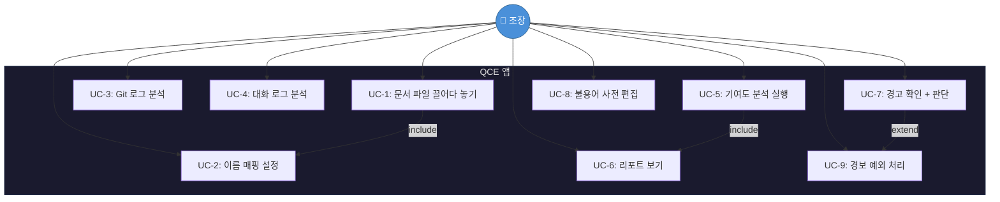

# 📄 QCE — 팀원 기여도 정량평가 솔루션

**Quantitative Contribution Evaluator**

> 조장의 PC 하나로, AI 없이, 팀원 기여도를 데이터로 증명한다.

---

| 버전 | 작성일 | 프로젝트 유형 |
|---|---|---|
| 1.0 | 2026-05-27 | Python 데스크톱 앱 (독립 실행형 .exe) |

---

## 👥 우리 팀

| 학번 | 이름 | 역할 | 맡는 일 |
|---|---|---|---|
| 20222047 | 조원희 | 백엔드 | 파일 파싱, Git 분석, 메신저 포맷 변환, 보안 |
| 20247142 | 이대한 | 프론트엔드 | PyQt6 UI, 대시보드, 차트, Drag & Drop |
| 20221985 | 김휘중 | 비즈니스 로직 | NLP 필터링, 점수 산출, 이상치 탐지, 신원 매핑 |

---

## 🎯 한 줄 요약

팀 프로젝트에서 "누가 얼마나 했는지"를 **주관적 감정 말고 데이터로 보여주는 앱**을 만든다.

- 📂 `.pptx`, `.docx` 파일 → 누가 얼마나 수정했는지 추출
- 🔧 Git 커밋 → 누가 코드를 얼마나 짰는지 계산
- 💬 카톡/슬랙 대화 → "넵", "ㅇㅇ" 같은 무의미 응답 빼고 실제 소통량 측정
- 📊 이 모든 걸 차트로 시각화 + 어뷰징(치팅) 자동 감지

---

## 🚫 절대 하지 않는 것들

이 앱은 다음을 **하지 않는다**:

- ❌ ChatGPT, Claude 같은 AI API 호출 — **분석은 100% 로컬 통계**
- ❌ 인터넷 서버로 데이터 전송 — **모든 데이터는 내 PC 안에서만**
- ❌ 다른 팀원 PC에 프로그램 설치 요구 — **조장 PC 1대로 끝**
- ❌ 실시간 모니터링 — **파일 모아서 한 번에 분석**

---

## 🏗️ 기술 스택 & 아키텍처

### 아키텍처: MVC 패턴

UI(View)와 데이터 처리(Model)를 **완벽히 분리**한다.

```
┌──────────────────────────────────────────────────────────────┐
│                        QCE 앱                                │
│                                                              │
│   🎨 View (이대한)          🔗 Controller (공동)              │
│   ┌──────────────┐        ┌──────────────────┐              │
│   │ PyQt6 UI     │◄──────►│ 이벤트 중재       │              │
│   │ 대시보드/차트  │        │ 데이터 전달       │              │
│   └──────────────┘        └────────┬─────────┘              │
│                                    │                         │
│   ⚙️ Model (조원희 + 김휘중)         ▼                         │
│   ┌──────────────────────────────────────────┐              │
│   │ DocumentParser │ GitAnalyzer │ ChatAdapter│  ← 조원희    │
│   ├──────────────────────────────────────────┤              │
│   │ NLPFilter │ ContributionEngine │ AliasMap │  ← 김휘중    │
│   └──────────────────────────────────────────┘              │
└──────────────────────────────────────────────────────────────┘
```

### 사용 기술

| 어디에 | 무엇을 | 왜 |
|---|---|---|
| **UI** | PyQt6 / PySide6 | 네이티브 데스크톱 앱, Drag & Drop 지원 |
| **차트** | pyqtgraph 또는 matplotlib | 파이차트, 산점도, 타임라인 렌더링 |
| **데이터 처리** | pandas, numpy | 대용량 텍스트/CSV 고속 연산 |
| **문서 파싱** | python-docx, python-pptx | .docx/.pptx 내부 메타데이터 추출 |
| **한국어 NLP** | KoNLPy | 형태소 분석으로 무의미 응답 필터링 |
| **이상치 탐지** | scikit-learn | Isolation Forest + Z-Score |
| **패키징** | PyInstaller 또는 Nuitka | 더블클릭으로 실행되는 .exe 만들기 |
| **테스트** | pytest | 모듈 단위 자동 테스트 |

---

## ⚡ 기능 목록

### 기능 1: 문서 파싱 & 신원 매핑

> *"이 pptx는 누가 만들고 누가 고쳤는지 알아낸다"*

**하는 일:**
1. 사용자가 `.pptx`, `.docx` 파일을 **화면에 끌어다 놓는다** (Drag & Drop)
2. 앱이 파일 내부의 `core.xml`, `app.xml`을 열어서 **OS 계정명**, **수정 바이트** 추출
3. 추출된 이름들(문서 계정명, 카톡 닉네임, Git 커밋 이름)을 **실제 팀원과 연결하는 매핑 화면** 제공

**예시 화면 흐름:**
```
[파일 Drag & Drop] → [파싱 결과 표시] → [매핑 UI]

  발견된 이름          실제 팀원 (드롭다운)
  ─────────────       ──────────────────
  "wonhee-pc"     →   조원희 ▼
  "DaeHan Lee"    →   이대한 ▼
  "김휘중_맥북"    →   김휘중 ▼
```

**예외 처리:**
- 지원 안 되는 확장자 → 오류 메시지
- 손상된 파일 → 경고 후 건너뛰기
- 매핑 안 된 이름 → 경고 표시 + 분석 제외 옵션

| 담당 | 모듈 |
|---|---|
| 이대한 | Drag & Drop UI, 매핑 화면 |
| 조원희 | OOXML 파싱 엔진 (`DocumentParser`) |
| 김휘중 | 매핑 비즈니스 로직 (`AliasMapper`) |

---

### 기능 2: Git 코드 기여도 + 조기 경보

> *"코드를 진짜 짰는지, 아니면 자동 생성기 돌렸는지 걸러낸다"*

**하는 일:**
1. 로컬 Git 저장소 경로를 지정하거나 `git log` 텍스트 파일을 업로드
2. 커밋별로 **누가, 언제, 몇 줄 추가/삭제**했는지 파싱
3. 팀원별 점수를 합산

**🚨 조기 경보 (Anti-Cheat) 시스템:**

| 규칙 | 조건 | 뜨는 경고 |
|---|---|---|
| **대량 커밋** | 한 번에 1,000줄 이상 변경 | ⚠️ "대량 코드 변경 감지 (자동 생성 코드 의심)" |
| **커밋 폭탄** | 24시간 내 커밋 빈도가 팀 평균의 3배 이상 | ⚠️ "비정상적인 수의 push 감지" |

- 조장이 "이건 초기 세팅이라 괜찮아"라고 **수동 예외 처리** 가능
- 경보가 뜬 팀원은 리포트에서 **빨간색으로 강조** 표시

| 담당 | 모듈 |
|---|---|
| 조원희 | Git 로그 파싱 (`GitAnalyzer`) |
| 김휘중 | 경보 규칙 엔진 (`EarlyWarningEngine`) |
| 이대한 | 경고 UI (`WarningPanel`) |

---

### 기능 3: 카톡/슬랙 대화 분석

> *"'넵', 'ㅇㅇ', 'ㅋㅋ'만 치는 팀원의 소통량을 0으로 만든다"*

**하는 일:**

**Step 1 — 포맷 자동 감지:**

카톡 내보내기 파일은 Windows/Mac에서 형식이 다르다. 앱이 알아서 판별한다.

| 플랫폼 | 시간 형식 예시 | 인코딩 |
|---|---|---|
| 카카오톡 (Windows) | `2026년 5월 27일 오전 1:00` | UTF-8 BOM |
| 카카오톡 (Mac) | `2026. 5. 27. 오전 1:00:00` | UTF-8 |
| 슬랙 | `2026-05-27T01:00:00Z` | UTF-8 JSON/CSV |

**Step 2 — 불용어 필터링 (NLP):**

정규표현식 + KoNLPy 형태소 분석으로 **무의미한 반응을 걸러낸다**:

| 걸러내는 것들 | 예시 |
|---|---|
| 단순 긍정 | 넵, 네, 넹, 넴, 응, 웅, 앙 |
| 단순 리액션 | ㅇㅇ, ㅋㅋ, ㅎㅎ, ㄱㄱ, ㄴㄴ |
| 감탄/이해 | 아하, 아~, 오오, 헐, 와 |
| 미디어 태그 | (이모티콘), (사진), (동영상) |

> 💡 불용어 사전은 사용자가 UI에서 **직접 추가/수정/삭제** 가능

**Step 3 → 결과:** 팀원별 **순수 유효 글자 수**, **유효 메시지 수** 산출

| 담당 | 모듈 |
|---|---|
| 조원희 | 포맷 어댑터 (`ChatAdapter`, `KakaoAdapter`, `SlackAdapter`) |
| 김휘중 | NLP 필터 + 불용어 관리 (`NLPFilter`, `StopwordsManager`) |

---

### 기능 4: 기여도 통계 & 이상치 탐지

> *"숫자로 누가 적게 했는지 통계적으로 증명한다"*

**하는 일:**

**Step 1 — 특성 매트릭스 구축:**

기능 1~3에서 뽑아낸 지표를 하나의 표로 합친다:

| 팀원 | 문서 수정량 | 코드 추가 | 코드 삭제 | 커밋 수 | 유효 소통 글자수 | 유효 메시지 수 |
|---|---|---|---|---|---|---|
| 팀원A | 0.82 | 0.95 | 0.71 | 0.88 | 0.63 | 0.55 |
| 팀원B | 0.15 | 0.08 | 0.12 | 0.10 | 0.22 | 0.18 |
| 팀원C | 0.73 | 0.70 | 0.65 | 0.78 | 0.91 | 0.87 |

*(값은 Min-Max 또는 Z-Score로 정규화)*

**Step 2 — Isolation Forest:**

scikit-learn의 Isolation Forest 알고리즘으로 **정상 패턴에서 벗어난 팀원**을 자동 식별한다.
→ 위 표에서 팀원B는 모든 지표가 낮으므로 이상치로 탐지됨

**Step 3 — Z-Score 판정:**

각 지표별 Z-Score를 계산해서, **Z-Score < -1.5인 지표가 2개 이상**이면 "기여도 하위 이상치"로 판정한다.

| 담당 | 모듈 |
|---|---|
| 김휘중 | 전체 (`ContributionEngine`) |

---

### 기능 5: 시각화 리포트

> *"차트 하나로 누가 얼마나 했는지 한눈에 보인다"*

**생성되는 차트들:**

| 차트 | 보여주는 것 | 우선순위 |
|---|---|---|
| 🥧 **파이 차트** | 팀원별 작업 지분율 (%) | 필수 |
| 🔵 **산점도** | X축: 소통량, Y축: 작업밀도 → 밸런스 확인 | 필수 |
| 📈 **타임라인** | 기간별 팀원 활동량 추이 | 선택 |
| 🕸️ **레이더 차트** | 지표별 균형도 | 선택 |
| 🌐 **네트워크 그래프** | 팀원 간 대화 상호작용 빈도 | 선택 |

**경고 강조:** 기능 2에서 조기 경보가 뜬 팀원은 모든 차트에서 **붉은색(#E53935) + ⚠️ 아이콘**으로 표시된다.

| 담당 | 모듈 |
|---|---|
| 이대한 | 전체 시각화 위젯 (`DashboardView`, 각종 `*_widget.py`) |
| 김휘중 | 경보 플래그 데이터 제공 |

---

## 🔒 지켜야 할 규칙들

### 규칙 1: 완전 로컬 (Air-Gapped)

| 규칙 | 왜? |
|---|---|
| AI API (OpenAI, Claude 등) 절대 호출 안 함 | 분석 결과의 신뢰성 + 프라이버시 |
| 클라우드 서버 연산 안 함 | 인터넷 없이도 작동해야 함 |
| 다른 팀원 PC에 프로그램 설치 안 함 | 조장 PC 하나로 완결 |

### 규칙 2: 보안 & 프라이버시

| 규칙 | 구체적으로 |
|---|---|
| API 권한은 **읽기 전용(Read-only)** | Git 등 외부 인증 시 데이터 수정 불가 |
| 데이터 외부 전송 **0바이트** | 네트워크로 아무것도 안 보냄 |
| 앱 종료 시 **캐시 즉시 파기** | 대화 내용, 코드 로그, 토큰 전부 메모리에서 삭제 |
| OAuth Token **디스크 저장 안 함** | 메모리에만 유지, 파일로 안 남김 |

### 규칙 3: 성능 기준

| 작업 | 제한 시간 |
|---|---|
| Git 로그 500커밋 분석 | ≤ 60초 |
| 카톡 대화 10MB NLP 필터링 | ≤ 120초 |
| **전체 파이프라인** (입력→리포트) | ≤ 5분 |
| 메모리 사용량 | ≤ 2GB |

### 규칙 4: 코드 품질

| 규칙 | 내용 |
|---|---|
| MVC 단방향 | View → Controller → Model (역방향 금지) |
| 어댑터 확장성 | 새 메신저 포맷 추가 시 기존 코드 수정 없이 플러그인 방식 (OCP) |
| 테스트 커버리지 | Model 계층 80% 이상 |
| Docstring | 모든 public 클래스/메서드에 필수 |

---

## 🔄 데이터 흐름 한눈에 보기

```
┌─────────────┐     ┌─────────────┐     ┌─────────────┐     ┌─────────────┐
│  📂 입력     │     │  🔄 전처리    │     │  📊 분석     │     │  📈 출력     │
│             │     │             │     │             │     │             │
│ .pptx/.docx │────►│ OOXML 파싱   │────►│             │     │ 파이 차트    │
│             │     │ 신원 매핑     │     │ 정규화 →     │────►│ 산점도      │
│ Git 로그     │────►│ 정량 평가    │────►│ 매트릭스 →   │     │ 타임라인    │
│             │     │ 조기 경보     │     │ Isolation   │     │ 레이더      │
│ 카톡/슬랙    │────►│ 포맷 변환    │────►│ Forest →    │     │             │
│ 대화 로그    │     │ NLP 필터     │     │ Z-Score     │     │ ⚠️ 경고 강조 │
└─────────────┘     └─────────────┘     └─────────────┘     └─────────────┘
```

---

## 👤 유스케이스 (조장이 하는 행동들)



| UC | 뭘 하나 | 언제 | 결과 |
|---|---|---|---|
| UC-1 | 문서 파일 끌어다 놓기 | 앱 켰을 때 | 메타데이터 추출됨 |
| UC-2 | 이름 매핑 설정 | 파일이나 로그 올린 후 | 모든 닉네임 → 실제 팀원 연결됨 |
| UC-3 | Git 로그 분석 | 저장소 경로 지정 | 코드 기여도 데이터 산출 |
| UC-4 | 대화 로그 분석 | 대화 파일 업로드 | 유효 소통량 산출 |
| UC-5 | 기여도 분석 실행 | 매핑 완료 + 1개 이상 데이터 있을 때 | 종합 기여도 결과 |
| UC-6 | 리포트 보기 | 분석 완료 후 | 대시보드에 차트 표시 |
| UC-7 | 경고 확인 | 경보 플래그 존재 시 | 조장이 판단 |
| UC-8 | 불용어 사전 편집 | 아무 때나 | 사전 업데이트 |
| UC-9 | 경보 예외 처리 | UC-7에서 "괜찮아" 판단 시 | 점수 재계산 |

---

## 📦 전제 조건 & 의존성

**이게 있어야 동작한다:**

| 필요한 것 | 이유 |
|---|---|
| Python 3.10+ (또는 패키징된 .exe) | 런타임 환경 |
| Git 로컬 클론 또는 git log 텍스트 | 코드 기여도 분석 소스 |
| 카톡/슬랙 대화 내보내기 파일 | 소통량 분석 소스 |
| JDK (Java) | KoNLPy 구동에 필수 |

**가정하는 것들:**
- 팀원은 2~10명 소규모 프로젝트 팀
- 입력 파일은 정상적인 Office Open XML 규격
- 메신저 내보내기는 각 플랫폼의 기본 내보내기 기능 사용

---

## 📋 누가 뭘 하나 — 최종 정리

### 조원희 (20222047) — ⚙️ 백엔드

| 만들 모듈 | 하는 일 |
|---|---|
| `DocumentParser` | .pptx/.docx 내부 XML 파싱 |
| `GitAnalyzer` | git log 파싱해서 기여도 데이터 추출 |
| `ChatAdapter` (카카오/슬랙) | 메신저별 포맷 차이 자동 변환 |
| 보안 모듈 | 토큰 관리, 종료 시 데이터 파기 |

### 이대한 (20247142) — 🎨 프론트엔드

| 만들 모듈 | 하는 일 |
|---|---|
| `MainWindow` | 메인 화면 + Drag & Drop |
| `AliasMappingView` | 신원 매핑 UI |
| `DashboardView` | 파이차트, 산점도, 타임라인 등 시각화 |
| `WarningPanel` | 조기 경보 표시 + 예외 처리 UI |

### 김휘중 (20221985) — 🧠 비즈니스 로직

| 만들 모듈 | 하는 일 |
|---|---|
| `AliasMapper` | 닉네임 → 실제 팀원 매핑 로직 |
| `EarlyWarningEngine` | 대량 커밋/커밋 폭탄 탐지 규칙 |
| `NLPFilter` | KoNLPy + 불용어 사전으로 무의미 응답 필터링 |
| `ContributionEngine` | 매트릭스 구축 + Isolation Forest + Z-Score |

---

## 📝 요구사항 추적표

> 모든 요구사항이 **누구 담당**이고 **어떤 유스케이스**와 연결되는지 한눈에 확인한다.

| ID | 무엇 | 누가 | 우선순위 |
|---|---|---|---|
| FR-1.1 | 문서 Drag & Drop | 이대한 + 조원희 | 필수 |
| FR-1.2 | OOXML 파싱 | 조원희 | 필수 |
| FR-1.3 | 신원 통합 매핑 | 이대한 + 김휘중 | 필수 |
| FR-2.1 | Git 정량 평가 | 조원희 | 필수 |
| FR-2.2 | 조기 경보 | 김휘중 + 이대한 | 필수 |
| FR-3.1 | 대화 포맷 감지 | 조원희 | 필수 |
| FR-3.2 | NLP 필터링 | 김휘중 | 필수 |
| FR-4.1 | 특성 매트릭스 | 김휘중 | 필수 |
| FR-4.2 | Isolation Forest | 김휘중 | 필수 |
| FR-4.3 | Z-Score 판정 | 김휘중 | 필수 |
| FR-5.1 | 파이 차트 | 이대한 | 필수 |
| FR-5.2 | 산점도 | 이대한 | 필수 |
| FR-5.3 | 고급 시각화 | 이대한 | 선택 |
| FR-5.4 | 경고 강조 | 이대한 + 김휘중 | 필수 |
| NFR-1 | 완전 로컬 (No AI/Cloud) | 전원 | 필수 |
| NFR-2 | 보안 & 프라이버시 | 전원 (주: 조원희) | 필수 |
| NFR-3 | 성능 기준 | 전원 | 필수 |
| NFR-4 | 코드 품질 (MVC/OCP/테스트) | 전원 | 필수 |

---

## 📖 용어 사전

| 용어 | 뜻 |
|---|---|
| **QCE** | Quantitative Contribution Evaluator — 이 프로젝트 이름 |
| **MVC** | Model-View-Controller — UI/로직/데이터 분리 패턴 |
| **OOXML** | Office Open XML — .docx, .pptx 파일 포맷 |
| **Isolation Forest** | 비지도 학습 이상치 탐지 알고리즘 |
| **Z-Score** | 평균에서 얼마나 벗어났는지 나타내는 표준 점수 |
| **Global Alias Mapping** | 여러 플랫폼의 닉네임을 실제 팀원 한 명에 연결하는 것 |
| **불용어(Stop-words)** | 분석에서 제외할 무의미 단어들 ("넵", "ㅇㅇ" 등) |
| **Air-Gapped** | 인터넷 없이 독립적으로 작동하는 환경 |
| **OCP** | 개방-폐쇄 원칙 — 기존 코드 수정 없이 기능 확장 가능한 설계 |

---

## 📎 참고 자료

| 이름 | 링크 |
|---|---|
| PyQt6 문서 | https://www.riverbankcomputing.com/static/Docs/PyQt6/ |
| scikit-learn 가이드 | https://scikit-learn.org/stable/user_guide.html |
| KoNLPy 문서 | https://konlpy.org/en/latest/ |
| python-docx 문서 | https://python-docx.readthedocs.io/ |
| python-pptx 문서 | https://python-pptx.readthedocs.io/ |

---

> 이 문서는 QCE 프로젝트의 공식 요구사항 명세서입니다. 변경 시 팀 합의 후 버전을 올려주세요.
