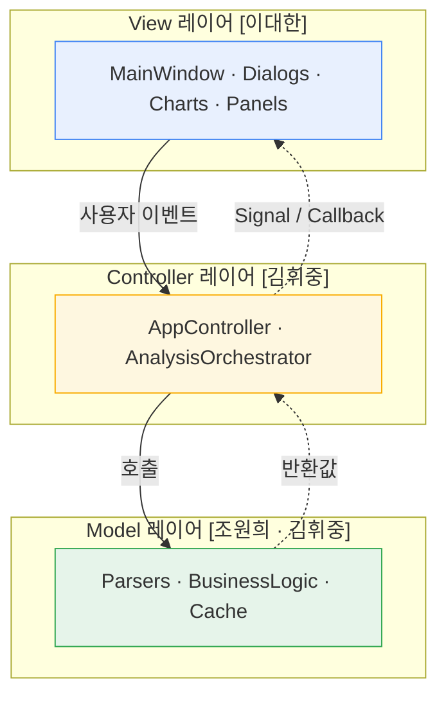
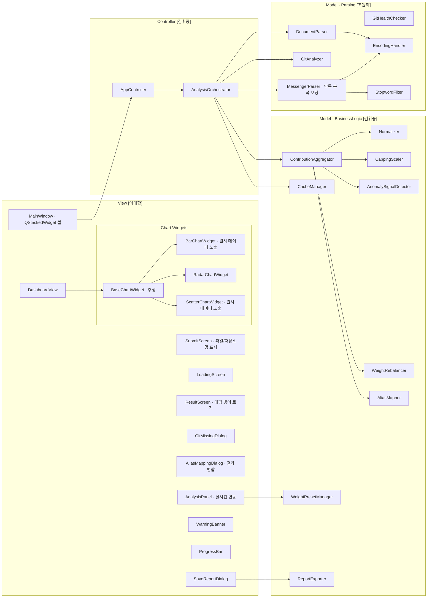
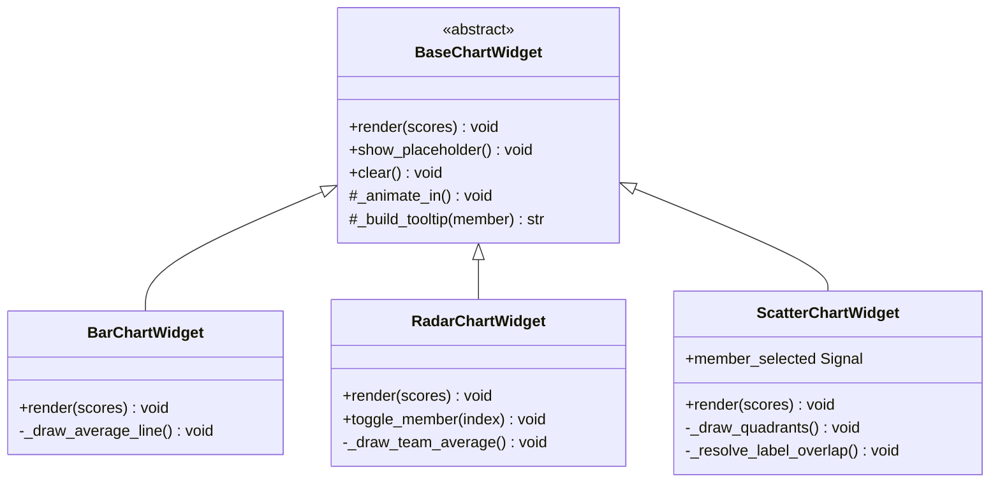
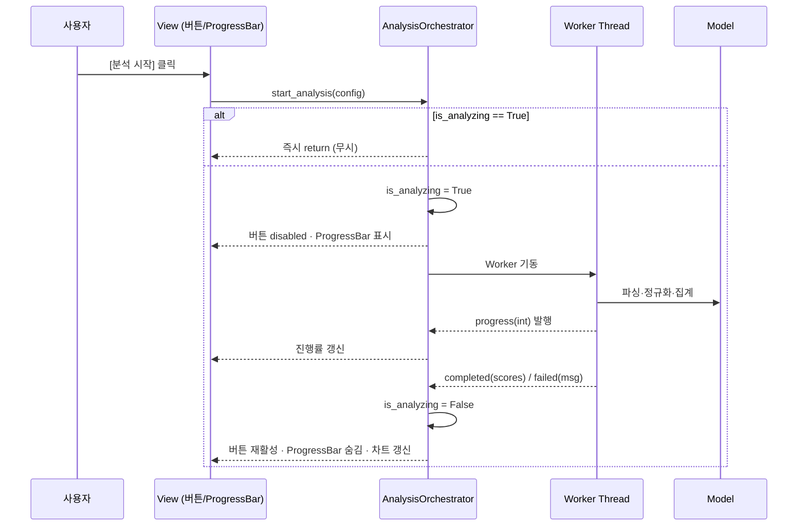
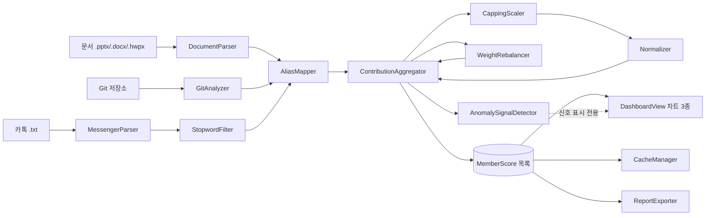
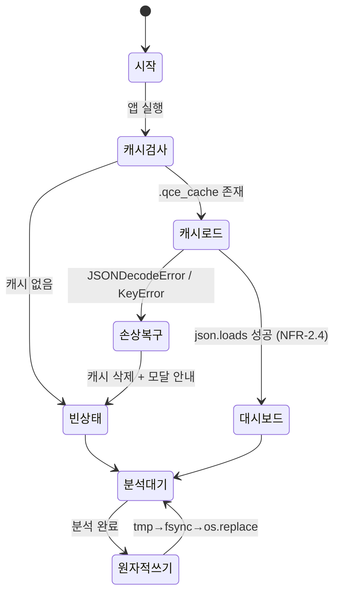

# Architecture Overview
## QCE — 부탁해 꼬마선장 (Quantitative Contribution Evaluator)

| 항목 | 내용 |
| --- | --- |
| 문서 버전 | v1.4 |
| 작성일 | 2026-06-01 |
| 준수 표준 | ISO/IEC/IEEE 29148-2018, ISO/IEC/IEEE 42010 (아키텍처 기술) |
| 상위 문서 | Requirements Record v1.5, Concept of Operations v1.3, Development Constraints v2.0 |
| 관련 ADR | ADR-0001(MVC), ADR-0002(PyQt6), ADR-0003(kiwipiepy>KoNLPy), ADR-0004(JSON 캐시 vs pickle) |
| 작성 주체 | QCE 개발팀 (20222047 조원희 · 20247142 이대한 · 20221985 김휘중) |

---

## 1. 문서 개요

### 1.1 목적
본 문서는 QCE의 소프트웨어 아키텍처를 정의한다. 시스템을 구성하는 레이어·컴포넌트·인터페이스와 그 사이의 흐름을 기술하고, 각 구조 결정이 어떤 요구사항·제약에서 도출되었는지 추적성을 박제한다.

### 1.2 범위
본 문서는 **아키텍처 개요와 레이어 경계 인터페이스 시그니처**까지를 다룬다. 각 컴포넌트의 내부 알고리즘·필드 단위 상세 설계는 하위 문서(`model-design.md`, `view-design.md`, `controller-design.md`)에서 다룬다.

### 1.3 다이어그램 표기 규약
본 문서의 다이어그램은 **Mermaid**로 작성된다. Mermaid는 문서 렌더링 도구이며 `QCE.exe` 런타임이나 PyInstaller 번들과 무관하므로(C-6 위배 없음), 사용자 설치 부담을 발생시키지 않는다. Mermaid 미지원 뷰어를 대비해 각 다이어그램에는 텍스트 트리/캡션 fallback을 병기한다.

> **참고.** 앱 런타임 차트는 matplotlib(C-5 허용 스택)로 그려지며, 이는 문서용 Mermaid와 전혀 다른 레이어다. 둘을 혼동하지 않는다.

---

## 2. 아키텍처 드라이버

아키텍처를 형성한 핵심 입력과 그것이 강제한 구조 결정이다.

| 드라이버 | 출처 | 강제된 구조 결정 |
| :--- | :--- | :--- |
| MVC 단방향 흐름 | C-4, ADR-0001 | View → Controller → Model 3-레이어. View의 Model import 금지 |
| 완전 로컬·네트워크 0 | C-1, C-2 | 네트워크 레이어 자체를 두지 않음. 외부 링크는 `webbrowser.open()` OS 위임만 |
| 비동기 UI 응답성 | NFR-1.1, NFR-1.2 | Controller에 Worker Thread 수명관리 컴포넌트(AnalysisOrchestrator) 분리. Worker↔UI는 Signal 경계 |
| 데이터 모듈 상호 격리 | NFR-3.2, C-4 | 파서 3종이 서로 import하지 않음. 통합은 Orchestrator만 수행. 1~2개 소스만으로도 동작 |
| 직렬화 JSON 한정 | C-8 | 영속 경계를 CacheManager 단일 컴포넌트로 격리. `pickle` 전면 배제 |
| JRE 의존 배제 | C-7, ADR-0003 | NLP는 순수 Python·C 확장(kiwipiepy/soynlp). StopwordFilter가 NLP 의존을 캡슐화 |
| 단일 실행 파일 | C-6 | 모든 의존성 PyInstaller `--onefile` 번들. 동적 import·플러그인 구조 지양 |
| 다형식 문서 입력 | FR-1.1 (.pptx/.docx/.hwpx) | DocumentParser 파사드 + 형식별 추출기(Strategy)로 확장점 격리 |
| 판정 금지 원칙 | STR-7, ConOps P5 | 이상 신호 컴포넌트(AnomalySignalDetector)는 점수 산출 경로와 분리. 신호는 표시 전용 |

---

## 3. 아키텍처 스타일 & 레이어

### 3.1 스타일
QCE는 **엄격한 MVC(Model-View-Controller)** 스타일을 채택한다(C-4, ADR-0001). 의존성은 단방향이며, 역방향 통신은 Signal/Callback으로만 이루어진다.



*Fallback 캡션: View는 사용자 이벤트를 Controller로 올린다 → Controller가 Model을 호출한다 → Model은 반환값만 돌려준다(View를 모름) → Controller가 결과를 Signal/Callback으로 View에 통보한다. 실선=직접 호출(하향), 점선=반환·Signal(상향).*

### 3.2 레이어별 책임과 금지사항

| 레이어 | 책임 | 금지사항 |
| :--- | :--- | :--- |
| **View** | 위젯 렌더링, 사용자 입력 수집, Signal 수신 후 화면 갱신 | Model을 `import`·직접 호출 금지. 분석 로직 보유 금지 |
| **Controller** | 이벤트 라우팅, V↔M 중재, Worker Thread 수명관리, 모듈 통합 | UI 위젯 직접 렌더링 금지. 도메인 계산 직접 수행 금지(Model에 위임) |
| **Model** | 파싱·정규화·집계·이상 신호·캐시. 순수 함수/클래스 | View·Controller를 `import` 금지. UI·스레드 객체 보유 금지 |

> **불변식(Invariant).** Model 레이어의 어떤 모듈도 PyQt6 심볼을 import하지 않는다. 이로써 Model은 UI 프레임워크와 독립적으로 pytest 단위 테스트가 가능하다(NFR-3.2 검증 전제).

---

## 4. 컴포넌트 분해

### 4.1 컴포넌트 다이어그램



*Fallback 캡션: MainWindow가 AppController를 통해 AnalysisOrchestrator를 호출하고, Orchestrator가 파서(Document/Git/Messenger)와 ContributionAggregator·CacheManager를 조율한다. SubmitScreen은 파일명 노출을, AnalysisPanel은 가중치 연동을, ResultScreen은 매핑 방어 로직을 담당한다. 차트 위젯 3종은 BaseChartWidget을 상속하며, 툴팁을 통해 원시 데이터를 노출한다.*

### 4.2 컴포넌트 책임 표

| 컴포넌트 | 레이어 | 담당 | 책임 | 추적 FR/NFR |
| :--- | :--- | :--- | :--- | :--- |
| MainWindow | View | 이대한 | 앱 셸·QStackedWidget 3-스크린 전환·메뉴·상태바 | FR-5.4 |
| SubmitScreen | View | 이대한 | 로고·설명·멀티포맷 드롭존·[분석 시작], 파일명/저장소명 실시간 노출("없음" 포함) 및 상태 리셋 지원 | FR-5.5 |
| LoadingScreen | View | 이대한 | 전체화면 진행률(ProgressBar 임베드) | FR-5.6 |
| ResultScreen | View | 이대한 | DashboardView+결측 배너+계정 병합+[새 분석], 매핑 취소 UI 증발 방어 및 미선택 가드 로직 포함 | FR-5.7 |
| GitMissingDialog | View | 이대한 | Git 부재 모달, 다운로드 링크 | FR-2.2 |
| AliasMappingDialog | View | 이대한 | 식별자 N:1 매핑 UI (v1.2: 결과 화면 병합 컨트롤로 재사용) | FR-1.3, FR-5.7 |
| AnalysisPanel | View | 이대한 | 가중치 슬라이더, 실시간 비례 연동 및 수치 표기, "작업 종류 별 반영 비율" 가이드 문구 노출 | FR-4.4 |
| DashboardView | View | 이대한 | 차트 3종 컨테이너·placeholder | FR-5.1 |
| BaseChartWidget | View | 이대한 | 차트 공통 추상(렌더·placeholder 텍스트 갱신·애니메이션 훅) | FR-5.1 |
| BarChartWidget | View | 이대한 | 막대 차트·원시 데이터(Raw) 노출 툴팁·평균선 | FR-5.1a |
| RadarChartWidget | View | 이대한 | 레이더 차트·범례 토글·평균 폴리곤 | FR-5.1b |
| ScatterChartWidget | View | 이대한 | 가용 데이터별 동적 산점도·십자선·클릭 연동·원시 데이터 노출 툴팁 | FR-5.1c |
| WarningBanner | View | 이대한 | 결측 경고 배너 | FR-5.3 |
| ProgressBar | View | 이대한 | 진행률 표시 | NFR-1.1 |
| SaveReportDialog | View | 이대한 | 저장 경로·형식 선택 | FR-5.2 |
| AppController | Controller | 김휘중 | 이벤트 라우팅, V↔M 중재, [새 분석] 세션 초기화(리셋) 통합 제어 | (전역) |
| AnalysisOrchestrator | Controller | 김휘중 | is_analyzing 가드, Worker 수명, 모듈 통합 | NFR-1.2, NFR-3.2 |
| DocumentParser | Model·Parse | 조원희 | 문서 파사드(.pptx/.docx/.hwpx)·작성자 집계 | FR-1.1, FR-1.2 |
| GitAnalyzer | Model·Parse | 조원희 | git log 수집 | FR-2.1 |
| GitHealthChecker | Model·Parse | 조원희 | git --version 점검 | FR-2.2 |
| MessengerParser | Model·Parse | 조원희 | 카톡 .txt 파싱·오염 줄 skip (단독 파이프라인 분석 보장) | FR-3.1, FR-3.2 |
| StopwordFilter | Model·Parse | 조원희 | 자동 불용어 분류(NLP) | FR-3.3 |
| EncodingHandler | Model·Parse | 조원희 | UTF-8→CP949 자동 감지 | NFR-3.1 |
| Normalizer | Model·BL | 김휘중 | Max 정규화 | FR-4.1 |
| CappingScaler | Model·BL | 김휘중 | Capping·로그 스케일 | FR-4.2 |
| AnomalySignalDetector | Model·BL | 김휘중 | Capping·EW-02 빈도·Z-Score 신호(표시 전용) | FR-4.2, FR-4.2b, FR-4.2d |
| NormalizedSignalsTracker | Model·BL | 김휘중 | 신호 "정상 표시" 예외(세션 한정) | FR-4.2c |
| WeightPresetManager | Model·BL | 김휘중 | 프리셋·합계 검증·실시간 재분배 연산(UI 연동) | FR-4.4 |
| WeightRebalancer | Model·BL | 김휘중 | 결측 소스 가중치 재조정 | FR-4.3 |
| AliasMapper | Model·BL | 김휘중 | 식별자 N:1 통합 | FR-1.3 |
| AliasExtractor | Model·BL | 김휘중 | 식별자 수집·병합 후보 제안(결정론) | FR-1.3 |
| ContributionAggregator | Model·BL | 김휘중 | 지표 통합·종합 점수 산출 | FR-4.* 통합 |
| CacheManager | Model·BL | 김휘중 | 원자적 JSON 캐시·손상 복구 | NFR-2.3, NFR-2.4 |
| ReportExporter | Model·BL | 김휘중 | .md/.csv 생성(BOM·경고) | FR-5.2, FR-5.3 |

### 4.3 차트 위젯 상속 구조

차트 3종은 공통 동작(placeholder 표시, 데이터 렌더, 진입 애니메이션, hover 툴팁 골격)을 `BaseChartWidget` 추상 클래스로 끌어올리고, 형식별 렌더만 하위 클래스가 구현한다. 이는 FR-5.1 공통 규칙(위젯 분리·Signal 경유)을 구조로 강제한다.



*Fallback 캡션: BaseChartWidget(추상)이 render/show_placeholder('분석할 데이터가 없습니다.' 안내 갱신)/clear 공개 메서드와 _animate_in/_build_tooltip(원시 데이터 포함) 보호 메서드를 정의한다. BarChartWidget·RadarChartWidget·ScatterChartWidget이 이를 상속하며, 각자 고유 메서드(막대 평균선, 레이더 토글, 산점도 라벨 겹침 해소)와 ScatterChartWidget의 member_selected Signal을 추가한다.*

---

## 5. 핵심 인터페이스 시그니처

레이어 경계의 계약을 Python 3.10+ 타입 힌트로 정의한다(C-5). 내부 구현은 하위 설계 문서에서 다룬다.

### 5.1 공용 데이터 타입

```python
from dataclasses import dataclass, field

@dataclass
class CommitStats:                      # FR-2.1
    commits: int
    additions: int
    deletions: int
    commits_list: list = field(default_factory=list)
    # commits_list[i] = {"hash","date","additions","deletions"} — 커밋 단위 명세
    # (FR-4.2 커밋별 Capping·FR-4.2b 빈도 신호·타임라인 근거)

@dataclass
class MessengerRecord:                  # FR-3.1
    author: str
    timestamp: str
    message: str

@dataclass
class ParseResult:                      # FR-3.2
    records: list[MessengerRecord]
    skipped_lines: int

@dataclass
class MemberScore:                      # FR-4.* 통합 결과 (차트·리포트 입력)
    author: str
    git_score: float                    # 0.0~1.0
    doc_score: float                    # 0.0~1.0
    msg_score: float                    # 0.0~1.0
    total_score: float                  # 0.0~1.0
    raw_additions: int                  # [개선] UI 툴팁 노출용 Git 원시 데이터
    raw_chars: int                      # [개선] UI 툴팁 노출용 문서 글자수
    raw_messages: int                   # [개선] UI 툴팁 노출용 메신저 발화수
    capping_applied: bool
    signals: list[str] = field(default_factory=list)          # 예: ["CAPPING","EW-02","ZSCORE"]
    signal_details: list[dict] = field(default_factory=list)  # 신호 카드 표시(4.2/4.2b/4.2d)·예외(4.2c)
    commit_dates: list[str] = field(default_factory=list)     # 커밋 일자(타임라인/드릴다운)
```

### 5.2 Model · Parsing 레이어 [조원희]

```python
class EncodingHandler:                  # NFR-3.1
    def read_text(self, path: str) -> str | dict[str, str]:
        """UTF-8 → CP949 순. 둘 다 실패 시 {"error": "encoding_failed", "path": path}."""

class DocumentParser:                   # FR-1.1, FR-1.2
    def parse(self, path: str) -> dict[str, int]:
        """확장자에 따라 OOXML/HWPX 추출기로 위임. 반환 {작성자: 유효 글자수}."""
    def count_shapes(self, path: str) -> int: ...

class GitAnalyzer:                      # FR-2.1
    GIT_TIMEOUT: int = 30
    def analyze(self, repo_path: str) -> dict[str, CommitStats]:
        """잘못된 경로·실패 시 빈 dict 반환(예외 비전파)."""

class GitHealthChecker:                 # FR-2.2
    def is_available(self) -> bool:
        """git --version (timeout 5s). 메인 윈도우 표시 전 1회 호출."""

class MessengerParser:                  # FR-3.1, FR-3.2
    def parse(self, path: str) -> ParseResult:
        """카카오톡 .txt 파싱. 오염 줄 skip + 카운트 (단독 분석 시 파이프라인 정상 보장)."""

class StopwordFilter:                   # FR-3.3
    def count_valid_messages(self, records: list[MessengerRecord]) -> dict[str, int]:
        """자동 불용어 제외 후 {작성자: 유효 메시지 수}. 사용자 편집 미제공·결정론."""
```

### 5.3 Model · BusinessLogic 레이어 [김휘중]

```python
class Normalizer:                       # FR-4.1
    def normalize(self, values: list[float]) -> list[float]:
        """(x-min)/(max-min). max==min이면 전원 0.5. round(_, 4)."""

class CappingScaler:                    # FR-4.2
    CAPPING_THRESHOLD: int = 50000
    def cap(self, additions: int) -> tuple[int, bool]:
        """반환 (capped_value, capping_applied)."""
    def log_scale(self, total: int) -> float: ...

class AnomalySignalDetector:            # FR-4.2, FR-4.2b, FR-4.2d  (표시 전용, 점수 미반영)
    def detect_frequency(self, repo: dict[str, CommitStats]) -> list[dict]: ...
    def detect_capping(self, repo: dict[str, CommitStats]) -> list[dict]: ...
    def detect_zscore(self, scores: list[MemberScore]) -> list[str]: ...
    def detect_zscore_detail(self, scores: list[MemberScore]) -> list[dict]: ...
    def build_signal_details(self, repo, scores) -> dict[str, list[dict]]: ...

class NormalizedSignalsTracker:         # FR-4.2c  (신호 "정상 표시" 예외, 세션 한정)
    def dismiss(self, author: str, signal_type: str, ref: str = "") -> None: ...
    def apply(self, scores: list[MemberScore]) -> list[MemberScore]: ...

class WeightPresetManager:              # FR-4.4
    PRESETS: dict[str, tuple[float, float, float]]
    def validate_sum(self, w_git: float, w_doc: float, w_msg: float) -> bool: ...
    def redistribute(self, changed_key: str, new_value: float, current: dict) -> dict[str, float]: ...
        """UI 실시간 연동: 한 가중치 조정 시 합 1.0을 유지하도록 나머지 비례 재분배."""

class WeightRebalancer:                 # FR-4.3
    def rebalance(
        self, weights: dict[str, float], available: set[str]
    ) -> dict[str, float]:
        """결측 소스 가중치 0, 나머지 상대 비율 유지 재조정. 합 1.0±0.0001."""

class AliasMapper:                      # FR-1.3
    def merge(self, raw: dict[str, dict], mapping: dict[str, str]) -> dict[str, dict]: ...

class AliasExtractor:                   # FR-1.3  (병합 후보 제안, 결정론)
    def suggest_groups(self, aliases: list[str]) -> dict[str, list[str]]: ...
    def suggest_mapping(self, identifiers: list[dict]) -> dict[str, str]: ...

class ContributionAggregator:           # FR-4.* 통합
    def aggregate(
        self,
        git: dict[str, CommitStats] | None,
        docs: dict[str, int] | None,
        msgs: dict[str, int] | None,
        weights: dict[str, float],
    ) -> list[MemberScore]:
        """가용 소스만으로 종합 점수 산출(NFR-3.2). None 소스는 WeightRebalancer 경유."""

class CacheManager:                     # NFR-2.3, NFR-2.4
    def save(self, data: dict) -> None:
        """tmp 쓰기 → fsync → os.replace 원자적 커밋. json만."""
    def load(self) -> dict:
        """JSONDecodeError·KeyError 시 캐시 삭제 후 빈 상태 반환."""

class ReportExporter:                   # FR-5.2, FR-5.3
    def to_markdown(self, scores: list[MemberScore], missing: set[str]) -> str: ...
    def to_csv(self, scores: list[MemberScore], missing: set[str]) -> bytes:
        """utf-8-sig(BOM)로 인코딩."""
```

### 5.4 Controller 레이어 [김휘중]

```python
class AnalysisOrchestrator(QObject):    # NFR-1.2, NFR-3.2
    progress  = pyqtSignal(int)         # 0~100
    completed = pyqtSignal(list)        # list[MemberScore]
    failed    = pyqtSignal(str)         # 오류 메시지

    is_analyzing: bool = False

    def start_analysis(self, config: dict) -> None:
        """is_analyzing True면 즉시 return(중복 차단). Worker Thread 기동."""
    def _on_worker_finished(self) -> None:
        """성공·오류·취소 무관 is_analyzing=False, 버튼 재활성 Signal."""

class AppController:
    def route_event(self, event: str, payload: dict) -> None: ...
    def on_analysis_completed(self, scores: list) -> None:
        """완료 Signal 수신 → DashboardView 갱신(메인 스레드)."""
    def reset_session(self) -> None:
        """[새 분석] 실행 시 이전 데이터 상태, 위젯 텍스트의 완전 초기화(리셋) 명령 라우팅."""
```

### 5.5 View 레이어 [이대한]

> **경계 데이터 계약.** View는 내부 타입(`MemberScore` 등)을 import하지 않고 plain dict만 소비한다(결정 A·INV-V1). Controller가 `dataclasses.asdict()`로 직렬화해 push한다. 상세 키 계약·시그니처는 `view-design.md` v1.3 §2.1·§5 참조.

```python
class MainWindow(QMainWindow):          # FR-5.4 — QStackedWidget 3-스크린 셸
    def show_submit(self)  -> None: ...
    def show_loading(self) -> None: ...
    def show_result(self)  -> None: ...

class SubmitScreen(QWidget):            # FR-5.5
    documents_dropped = pyqtSignal(list)
    git_repo_chosen   = pyqtSignal(str)
    messenger_dropped = pyqtSignal(str)   # AnalysisPanel(FR-4.4) 합성
    def clear_inputs(self) -> None:
        """[새 분석] 복귀 시 적재된 파일명/저장소명 및 UI 텍스트("없음" 원복) 초기화."""

class ResultScreen(QWidget):            # FR-5.7
    merge_requested        = pyqtSignal(dict)   # {alias→member} 결과 화면 병합 → 재집계
    new_analysis_requested = pyqtSignal()
    def render(self, scores: list[dict], missing: set[str]) -> None: ...
    def reset_mapping_state(self) -> None:
        """매핑 취소 동작 시 UI 증발 방지 및 미선택 상태 가드 복구."""

class BaseChartWidget(QWidget):         # FR-5.1
    def render(self, scores: list[dict], missing: set[str]) -> None: ...  # 추상, dict 소비
    def show_placeholder(self) -> None: ...                                # "분석을 실행하면..."
    def show_placeholder(self) -> None: 
        """초기 상태 시 '분석할 데이터가 없습니다.' 텍스트 출력"""
    def clear(self) -> None: ...

class ScatterChartWidget(BaseChartWidget):   # FR-5.1c
    member_selected = pyqtSignal(str)   # 점 클릭 → 레이더 하이라이트 연동
```

> **Signal 경계 불변식.** Worker Thread는 위 Signal을 *발행*만 하고, 슬롯(UI 갱신)은 메인 스레드에서 실행된다. Worker가 위젯을 직접 수정하는 경로는 존재하지 않는다(NFR-1.2).

---

## 6. 동시성 모델

분석 파이프라인 전체는 Worker Thread에서 실행되어 메인 UI 스레드를 점유하지 않는다(NFR-1.1). 중복 실행은 `is_analyzing` 가드로 차단한다(NFR-1.2).



*Fallback 캡션: 클릭 시 Orchestrator가 is_analyzing을 검사한다. True면 즉시 무시. False면 True로 잠그고 버튼을 비활성화한 뒤 Worker를 기동한다. Worker는 Model을 호출하고 progress/completed/failed Signal을 Orchestrator에 발행한다. 종료 시(성공·오류 무관) Orchestrator가 is_analyzing을 해제하고 버튼을 재활성화한다. UI 수정은 전부 메인 스레드에서 일어난다.*

**불변식 요약**
- 상태 복원(`is_analyzing=False`, 버튼 재활성)은 성공·오류·취소·RuntimeError 모든 경로에서 보장된다.
- Worker는 UI 객체를 직접 참조하지 않는다. 통신은 Signal 단방향(Worker→메인)뿐이다.

---

## 7. 데이터 흐름

입력 적재부터 시각화까지의 파이프라인. 모듈 격리(NFR-3.2)에 따라 일부 소스가 없어도 가용 소스만으로 흐름이 완결된다.



*Fallback 캡션: 세 입력이 각자 파서를 거쳐 AliasMapper에서 인격 단위로 통합된다. 카카오톡 단독 입력 시에도 파이프라인이 중단 없이 정상 동작한다. ContributionAggregator가 Capping→정규화→가중치 재조정을 조율해 MemberScore 목록을 만들고, 이것이 차트·캐시·리포트로 분기한다. AnomalySignalDetector의 출력은 점수에 합산되지 않고 차트 강조용으로만 흐른다(판정 금지).*

**결측 처리 흐름(FR-4.3).** 임의 소스가 None이면 AliasMapper 단계에서 누락되고, WeightRebalancer가 해당 가중치를 0으로 만든 뒤 나머지를 합 1.0으로 재정규화한다. WarningBanner·리포트 경고는 결측 소스 집합을 받아 표시한다(FR-5.3).

**신원 병합 흐름(FR-1.3 / FR-5.7).** 1차 분석은 사전 매핑 없이 각 식별자를 독립 인물로 산출한다(AliasMapper에 항등 매핑 통과). 조장이 **결과 화면**에서 동일인의 계정들을 1인으로 병합하면, View가 `merge_requested(mapping)`를 올리고 Controller가 보유 중인 원시 지표에 새 매핑을 적용해 `AliasMapper.merge → ContributionAggregator(재정규화)`를 다시 돌려 결과를 재렌더한다. 정규화가 팀원 집합 전체에 의존하므로 병합은 시각 합산이 아닌 **재집계**다(NFR-1.2 가드·NFR-1.3 결정론 재적용). 분석-전 매핑 모달은 폐기되었다(RR v1.4).

---

## 8. 캐시·영속성

CacheManager가 영속 경계를 단독으로 캡슐화한다. 직렬화는 JSON만 사용한다(C-8, ADR-0004). 저장 항목은 식별자·정규화 점수·타임스탬프·가중치 설정으로 한정되며, 메시지 본문·소스코드는 저장하지 않는다(NFR-2.3).



*Fallback 캡션: 실행 시 .qce_cache가 있으면 원본 검사 없이 즉시 역직렬화해 대시보드를 띄운다(NFR-2.4). 로드 중 손상이면 캐시를 삭제하고 모달 안내 후 빈 상태로 시작한다. 분석 완료 시 tmp 파일에 완전 쓰기 → fsync → os.replace의 3단계 원자적 커밋을 수행한다(NFR-2.3).*

---

## 9. 아키텍처 추적성 매트릭스

컴포넌트가 어떤 요구사항을 실현하고 어떤 제약에 구속되는지의 설계 수준 RTM이다. 요구사항 수준 추적은 RR §6을 따른다.

| 컴포넌트 | 실현 FR/NFR | 구속 제약 |
| :--- | :--- | :--- |
| DocumentParser | FR-1.1, FR-1.2 | C-5, C-6 |
| GitAnalyzer | FR-2.1 | C-9 |
| GitHealthChecker | FR-2.2 | C-9 |
| MessengerParser | FR-3.1, FR-3.2 | C-5 |
| StopwordFilter | FR-3.3 | C-7 |
| EncodingHandler | NFR-3.1 | C-5 |
| Normalizer · CappingScaler | FR-4.1, FR-4.2 | — |
| AnomalySignalDetector | FR-4.2, FR-4.2b, FR-4.2d | STR-7, ConOps P5 (판정 금지) |
| NormalizedSignalsTracker | FR-4.2c | STR-7, OI-1 (세션 한정) |
| WeightRebalancer · WeightPresetManager | FR-4.3, FR-4.4 | — |
| AliasMapper · AliasExtractor | FR-1.3 | 자동 병합 금지, NFR-1.3 |
| ContributionAggregator | FR-4.* 통합 | NFR-3.2 |
| CacheManager | NFR-2.3, NFR-2.4 | C-8 |
| ReportExporter | FR-5.2, FR-5.3 | — |
| AnalysisOrchestrator | NFR-1.1, NFR-1.2, NFR-3.2 | C-5 |
| AppController | (전역 라우팅) | C-4 |
| BaseChartWidget 외 차트 3종 | FR-5.1, FR-5.1a/b/c | C-5 (matplotlib) |
| DashboardView · WarningBanner · ProgressBar | FR-5.1, FR-5.3, NFR-1.1 | C-4 |
| MainWindow · SubmitScreen · LoadingScreen · ResultScreen | FR-5.4, FR-5.5, FR-5.6, FR-5.7 | C-4 |
| GitMissingDialog · AliasMappingDialog · AnalysisPanel · SaveReportDialog | FR-2.2, FR-1.3/FR-5.7, FR-4.4, FR-5.2 | C-4 |
| 전 레이어 | — | C-1, C-2 (네트워크 레이어 부재) |

> **MVC 불변식 검증 포인트.** 정적 분석(import 그래프)에서 View→Model 직접 의존이 0건이어야 하며, Model 레이어에서 PyQt6 import가 0건이어야 한다(C-4, NFR-3.2 Fail 조건).

---

## 10. 문서 변경 이력

| 버전 | 일자 | 변경 | 작성자 |
| :--- | :--- | :--- | :--- |
|v1.0|2026-05-28|최초 작성. RR v1.3·ConOps v1.2·dev-constraints v2.0 기준 9장 구성. DocumentParser 파사드(.hwpx 반영), 카톡 전용 MessengerParser·자동 StopwordFilter(FR-3.1/3.3 반영), AnomalySignalDetector 분리(판정 금지), 차트 BaseChartWidget 상속 구조, 핵심 인터페이스 시그니처, 동시성·데이터 흐름·캐시 다이어그램, 아키텍처 RTM 포함| 이대한 |
|**v1.1**|**2026-05-28**|**MVC 구현 책임 배정 명확화: Controller 레이어 담당을 "공동" → **김휘중** 단독으로 변경(§3.1 레이어 다이어그램, §4.1 컴포넌트 다이어그램, §4.2 컴포넌트 책임 표의 AppController·AnalysisOrchestrator, §5.4 절 제목). View 레이어(이대한), Model 레이어(조원희 · 김휘중 공동)는 기존과 동일하게 유지. 인터페이스 시그니처·다이어그램 구조 등 그 외 내용 변경 없음.**| 이대한 |
| **v1.2** | **2026-05-31** | **3-스크린 구조(FR-5.4)·결과 화면 계정 병합(FR-5.7) 반영(RR v1.4·view-design v1.3 동기화). (1) 상위 문서 참조를 RR v1.4·ConOps v1.3로 갱신. (2) §4.1 View 컴포넌트 다이어그램에 SubmitScreen·LoadingScreen·ResultScreen 추가, MainWindow를 QStackedWidget 셸로·AliasMappingDialog를 결과 병합으로 표기. (3) §4.2 책임표에 3-스크린 행 추가, MainWindow(FR-5.4)·AliasMappingDialog(FR-1.3/5.7)·AnalysisPanel(SubmitScreen 합성) 갱신. (4) §5.5 View 시그니처에 MainWindow 화면 전환·SubmitScreen·ResultScreen(merge_requested) 클래스 추가, 차트 render를 list[dict] 소비로 정정, 경계 dict 계약 주석 추가. (5) §7 데이터 흐름에 신원 병합(분석-후 재집계) 흐름 문단 추가. (6) §9 RTM에 3-스크린 행 추가·AliasMappingDialog에 FR-5.7 연결. Controller 레이어 상세(병합 재집계 오케스트레이션)는 controller-design.md 담당자 갱신 대상으로 남김.** | QCE 개발팀 (이대한) |
|**v1.3**|**2026-05-31**|**구 SRS.md 폐지에 따른 정합화 및 구현분(A1~A4) 반영. (1) 상위 문서 참조에서 폐지된 SRS v2.2 제거, RR v1.5로 갱신. (2) §5.1 공용 타입을 실제 코드와 일치화: `CommitStats.commits_list` 추가, MemberScore 필드명 정정(`raw_chars`·`raw_messages`·`signals`) 및 `signal_details`·`commit_dates` 추가. (3) §4.2 컴포넌트 표·§5 시그니처·§9 RTM에 NormalizedSignalsTracker(FR-4.2c 예외)·AliasExtractor(FR-1.3) 추가, AnomalySignalDetector에 detect_capping/detect_zscore_detail/build_signal_details, WeightPresetManager에 redistribute 반영, AnomalySignalDetector 실현 FR에 FR-4.2·FR-4.2d 명시(번호 체계: 4.2c=예외·4.2d=Z-Score, RR v1.5 정합). 상세는 model-business-logic-design v1.3·view-design v1.4 참조.**| 이대한 |
|v1.4|2026-06-01|사용자 피드백(UI/UX 개선 및 버그 수정) 반영: AppController 세션 초기화 메서드(reset_session), SubmitScreen 입력 초기화(clear_inputs) 및 파일명("없음" 포함) 노출 추가, AnalysisPanel 실시간 연동/수치 표기/가이드 문구 추가, ResultScreen 매핑 방어 로직 명시, BaseChartWidget placeholder 텍스트 갱신, 차트 위젯 원시 데이터(Raw Data) 노출 추가 명문화.| 이대한 |
|**v1.5**|**2026-06-02**|**사용자 피드백 반영(산점도 시각화 개선): 3개 소스 입력 시 산점도의 세 번째 데이터 크기(Z축)를 단순 투명도(채도) 조절에서 색상 그라데이션 보간 방식으로 변경 명시.**| 이대한 |
| **v1.6** | **2026-06-02** | **Capping 한도 상향 및 전역 UI 개선 동기화.** | 이대한, 김휘중 공동 작업 |
