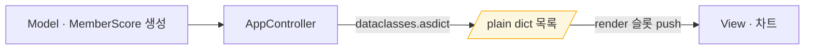
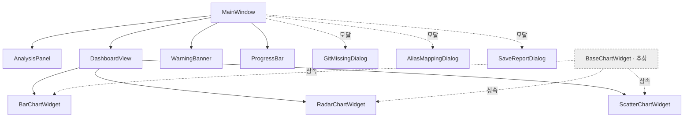
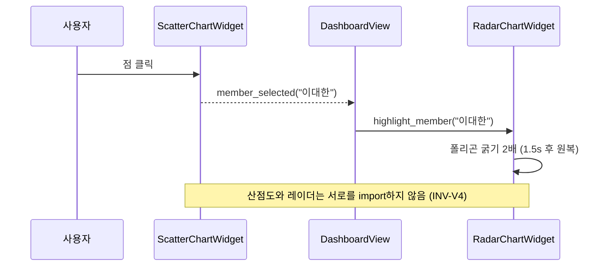
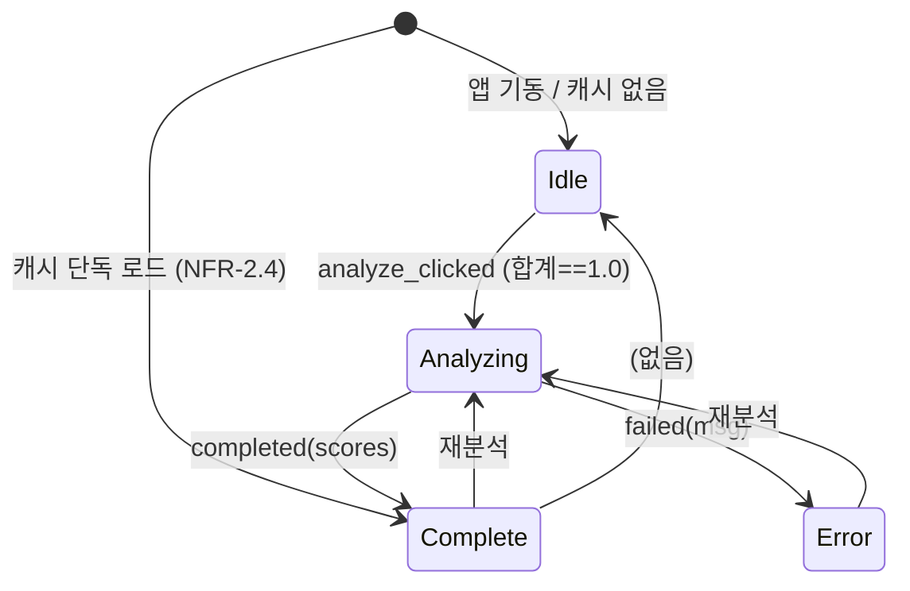

# View Design
## QCE — 부탁해 꼬마선장 (Quantitative Contribution Evaluator)

| 항목 | 내용 |
| --- | --- |
| 문서 버전 | v1.1 |
| 작성일 | 2026-05-29 |
| 준수 표준 | ISO/IEC/IEEE 29148-2018, ISO/IEC/IEEE 42010 (아키텍처 기술) |
| 상위 문서 | architecture-overview.md v1.0, Requirements Record v1.3, Concept of Operations v1.2, Development Constraints v2.0 |
| 관련 ADR | ADR-0001(MVC), ADR-0002(PyQt6) |
| 작성 주체 | QCE 개발팀 (View 담당 20247142 이대한 · 검토 20222047 조원희 · 20221985 김휘중) |

---

## 1. 문서 개요

### 1.1 목적
본 문서는 QCE의 **View 레이어 내부 상세 설계**를 정의한다. architecture-overview.md가 레이어 경계와 컴포넌트 책임·경계 시그니처까지를 다뤘다면, 본 문서는 그 경계 안으로 들어가 각 위젯의 합성 구조, 공개 인터페이스, 차트 렌더링·애니메이션·툴팁 모델, 스레드 경계에서의 슬롯 동작, 그리고 FR-5.1d pytest가 검사할 테스트 가능 표면을 기술한다.

### 1.2 범위
- **다룬다:** View 파일·모듈 분해와 LOC 예산, 위젯 합성 트리, View↔Controller 경계 계약, 컴포넌트별 공개 API, 차트 3종의 렌더·애니메이션·툴팁·차트간 연동, UI 상태 전이, 스타일 토큰, 테스트 접근자.
- **다루지 않는다:** Model 내부 알고리즘(→ `model-design.md`), Controller 라우팅·Worker 수명관리·DTO 직렬화 상세(→ `controller-design.md`), 빌드/패키징(→ `06-implementation/`).

### 1.3 다이어그램 표기 규약
다이어그램은 **Mermaid**로 작성하며, 미지원 뷰어를 위해 각 다이어그램에 텍스트 fallback 캡션을 병기한다(architecture-overview §1.3 규약 승계). Mermaid는 문서 렌더링 도구일 뿐 `QCE.exe` 런타임과 무관하다(C-6 무영향).

> **참고.** 본 문서의 Mermaid는 *문서용 다이어그램*이고, 앱이 실제로 그리는 차트는 **matplotlib**(C-5 허용 스택)다. 둘은 전혀 다른 레이어이며 혼동하지 않는다.

---

## 2. View 설계 원칙·불변식

View 레이어는 다음 불변식을 **구조로** 강제한다. 각 불변식은 정적 분석 또는 pytest로 검증 가능한 Fail 조건을 가진다.

| # | 불변식 | 근거 | 검증 방법 (Fail 조건) |
| :--- | :--- | :--- | :--- |
| **INV-V1** | View 모듈은 어떤 프로젝트 내부 타입도 import하지 않는다 — `model.*`·`controller.*`·`common.*`(DTO 포함) 전부. View 경계로 들어오는 모든 데이터는 **plain dict·원시값**이다. | C-4, ADR-0001 | `grep -rE "from qce\.(model\|controller\|common)" view/` 결과 1건 이상 → Fail |
| **INV-V2** | View 모듈은 `controller.*`를 import하지 않는다. View는 Signal을 *발행*만 하고, 연결(connect)은 Controller가 수행한다. | C-4 | `view/`에서 `from ...controller` 발견 → Fail (INV-V1에 포함되나 별도 명시) |
| **INV-V3** | Worker Thread는 어떤 View 위젯도 직접 수정하지 않는다. 모든 화면 갱신 슬롯은 메인 스레드에서 실행된다. | NFR-1.1, NFR-1.2 | Worker 컨텍스트에서 위젯 메서드 호출 발견 → Fail |
| **INV-V4** | 차트 위젯은 서로를 직접 참조하지 않는다. 차트간 연동은 부모(DashboardView)가 Signal을 중재한다. | FR-5.1 | `bar_chart`/`radar_chart`/`scatter_chart` 상호 import 발견 → Fail |
| **INV-V5** | 진입 애니메이션 진행 중 hover 툴팁 이벤트는 비활성이며, 애니메이션 종료 후에만 활성화된다. | FR-5.1a/b/c | 애니 진행 플래그 True 상태에서 툴팁 표시 → Fail |

### 2.1 View 경계 데이터 계약 (결정 A — 엄격 격리)

차트는 팀원별 점수를 입력으로 받는다. 그 점수가 **어떤 형태로 View 경계를 넘는가**를 다음과 같이 정한다. 본 절은 v1.0의 "common/dto 타입 참조" 방식을 폐기하고, **View가 프로젝트 내부 타입을 일절 import하지 않는 엄격 격리**로 대체한다.

- **View는 plain dict만 소비한다.** 차트·다이얼로그 등 모든 View 컴포넌트는 `MemberScore` 같은 객체가 아니라 `dict`(및 `list[dict]`)를 받는다. View 코드 어디에도 `MemberScore`·`CommitStats`·`IdentifierInfo` 심볼이 등장하지 않는다.
- **직렬화는 Controller의 책임.** Model(`ContributionAggregator`)이 `MemberScore` 인스턴스를 만들고, **AppController가 View 슬롯으로 push하기 직전에 `dataclasses.asdict()`로 dict로 변환**한다. View는 변환 결과만 받는다. `MemberScore` dataclass 정의는 `common/dto.py`에 남되 **Model·Controller만 사용**하며 View는 import하지 않는다(INV-V1).
- **키 계약은 View가 소유한다.** 문자열 키 오타를 막기 위해 View가 기대하는 키 집합을 `view/contract.py`에 상수로 정의한다(매직 스트링 금지). Controller가 push하는 dict는 이 키 집합(§5.3 표)을 정확히 만족해야 한다. 이 계약표가 Controller dict와 View 기대값의 단일 출처다.



*Fallback 캡션: Model이 MemberScore를 만들어 AppController에 넘기면, Controller가 push 직전에 dataclasses.asdict로 plain dict 목록(노란색 경계)으로 직렬화해 View의 render 슬롯에 넣는다. View는 MemberScore라는 타입을 전혀 모르고, 약속된 dict 키만 안다.*

> **트레이드오프(명시).** 이 방식은 `view/ → {model,controller,common}` import를 **0건**으로 만들어 MVC 단방향을 한 줄 grep으로 검증 가능하게 한다(장점). 비용은 View에서 `data["git_score"]`처럼 문자열 키 접근이라 타입체커가 오타를 못 잡는다는 점이며, `view/contract.py` 키 상수와 §5.3 계약표로 완화한다.

### 2.2 허용/금지 import 요약

| 구분 | 항목 |
| :--- | :--- |
| **허용** | `PyQt6.*`, `matplotlib.*`(+ `matplotlib.backends.backend_qtagg`), `qce.view.*`(형제 View 모듈·`view.contract` 포함, 부모가 자식 위젯을 합성하는 경우) |
| **금지** | `qce.model.*`·`qce.controller.*`·`qce.common.*`(DTO 포함) 전부(INV-V1·V2), 네트워크 라이브러리(`requests`/`urllib`/`socket` 등, C-2), `pickle`(C-8) |

---

## 3. 파일·모듈 구조 & LOC 예산

architecture-overview §4.2의 View 컴포넌트 12종을 **1파일=1위젯** 원칙으로 분리한다(FR-5.1 "독립 위젯 클래스 분리"를 디렉토리 구조로 강제). LOC는 임의 배분이 아니라 **각 컴포넌트가 짊어진 수용기준 수**에 비례한다.

```
qce/
├── common/
│   └── dto.py                      # MemberScore 등. Model·Controller 전용. View는 import 금지(INV-V1)
└── view/
    ├── __init__.py
    ├── contract.py                 # View가 기대하는 dict 키 상수 (View 소유, 매직 스트링 방지)
    ├── main_window.py              # MainWindow
    ├── style/
    │   ├── tokens.py               # 색상·폰트·치수 토큰
    │   └── qss.py                  # QSS 스타일시트 문자열
    ├── dialogs/
    │   ├── git_missing_dialog.py   # GitMissingDialog
    │   ├── alias_mapping_dialog.py # AliasMappingDialog
    │   └── save_report_dialog.py   # SaveReportDialog
    ├── panels/
    │   ├── analysis_panel.py       # AnalysisPanel
    │   ├── dashboard_view.py       # DashboardView (3차트 컨테이너 + 신호 중재)
    │   ├── warning_banner.py       # WarningBanner
    │   └── progress_bar.py         # ProgressBar
    └── charts/
        ├── base_chart.py           # BaseChartWidget (추상)
        ├── bar_chart.py            # BarChartWidget
        ├── radar_chart.py          # RadarChartWidget
        └── scatter_chart.py        # ScatterChartWidget
```

| 파일 | 컴포넌트 | 추적 FR/NFR | 예상 LOC |
| :--- | :--- | :--- | ---: |
| `contract.py` | View dict 키 상수 (결정 A 격리 지원) | INV-V1 | ~30 |
| `main_window.py` | MainWindow (셸·메뉴·Drag&Drop·신호배선·헬스체크 트리거·상태바) | 전역 | ~280 |
| `dialogs/git_missing_dialog.py` | GitMissingDialog | FR-2.2 | ~70 |
| `dialogs/alias_mapping_dialog.py` | AliasMappingDialog (N:1 매핑·미매핑 경고) | FR-1.3 | ~230 |
| `dialogs/save_report_dialog.py` | SaveReportDialog | FR-5.2 | ~80 |
| `panels/analysis_panel.py` | AnalysisPanel (프리셋·슬라이더·합계검증) | FR-4.4 | ~270 |
| `panels/dashboard_view.py` | DashboardView (3차트 컨테이너·차트간 Signal 중재·신호 목록) | FR-5.1 | ~150 |
| `panels/warning_banner.py` | WarningBanner | FR-5.3 | ~70 |
| `panels/progress_bar.py` | ProgressBar | NFR-1.1 | ~50 |
| `charts/base_chart.py` | BaseChartWidget (Canvas·placeholder·애니훅·툴팁 골격) | FR-5.1 | ~190 |
| `charts/bar_chart.py` | BarChartWidget | FR-5.1a | ~270 |
| `charts/radar_chart.py` | RadarChartWidget | FR-5.1b | ~340 |
| `charts/scatter_chart.py` | ScatterChartWidget | FR-5.1c | ~390 |
| `style/tokens.py` | 색상·폰트·치수 토큰 | C-5 | ~50 |
| `style/qss.py` | QSS 스타일시트 | C-5 | ~60 |
| **View 합계** | | | **~2,530** |

> **분량 관찰.** 차트 4파일(Base+3종)이 **~1,190줄로 전체의 약 47%**를 차지한다. FR-5.1a/b/c가 각각 툴팁 항목 수·진입 애니메이션(20프레임/30ms)·평균선/십자선·라벨 겹침 해소·클릭 연동까지 수용기준을 10~15개씩 달고 있어 자연스럽게 무거워진다. 목표 분량 ~2,500줄은 사실상 차트 인터랙션 요구가 결정한다. 분량을 줄이려면 차트 인터랙션을, 늘리려면 같은 곳을 조정한다.

---

## 4. 위젯 합성 트리

부모가 자식을 *합성(composition)*하며, 자식은 부모를 모른다. 모든 상향 통신은 Signal이다.



*Fallback 캡션: MainWindow가 AnalysisPanel·DashboardView·WarningBanner·ProgressBar를 영구 자식으로, 세 다이얼로그를 모달로 합성한다. DashboardView가 막대·레이더·산점도 위젯을 합성한다. 세 차트는 추상 BaseChartWidget을 상속(점선)한다. 차트 3종은 서로를 참조하지 않으며 연동은 DashboardView가 중재한다(INV-V4).*

---

## 5. View↔Controller 계약

View와 Controller의 경계 계약을 두 방향으로 카탈로그한다. **상향(intent)**은 View가 발행하는 Signal, **하향(result)**은 Controller(AppController)가 메인 스레드에서 호출하는 슬롯이다. 연결(connect)은 전적으로 Controller의 배선 코드가 수행한다(INV-V2). 하향으로 전달되는 모든 복합 데이터는 plain dict다(결정 A).

### 5.1 상향 — View가 발행하는 Signal (사용자 의도)

| 발신 위젯 | Signal | 페이로드 | 의미 | 추적 |
| :--- | :--- | :--- | :--- | :--- |
| MainWindow | `documents_dropped` | `list[str]` | 문서 파일 경로 적재 | FR-1.1 |
| MainWindow | `git_repo_chosen` | `str` | Git 로컬 저장소 경로 선택 | FR-2.1 |
| MainWindow | `messenger_dropped` | `str` | 카카오톡 `.txt` 경로 적재 | FR-3.1 |
| MainWindow | `alias_mapping_requested` | `()` | 매핑 다이얼로그 열기 요청 | FR-1.3 |
| MainWindow | `save_report_requested` | `()` | 리포트 저장 요청 | FR-5.2 |
| AnalysisPanel | `weights_changed` | `dict` (`w_git,w_doc,w_msg`) | 슬라이더 조정 | FR-4.4 |
| AnalysisPanel | `preset_chosen` | `str` | 프리셋 버튼 선택 | FR-4.4 |
| AnalysisPanel | `analyze_clicked` | `()` | [분석 시작] 클릭 | NFR-1.2 |
| AliasMappingDialog | `mapping_confirmed` | `dict` (`alias→member`) | 매핑 확정 | FR-1.3 |
| SaveReportDialog | `path_chosen` | `(str path, str fmt)` | 저장 경로·형식 확정 | FR-5.2 |
| ScatterChartWidget | `member_selected` | `str` | 산점도 점 클릭 | FR-5.1c |

### 5.2 하향 — Controller가 호출하는 View 슬롯 (결과 push)

복합 데이터는 모두 `dict`/`list[dict]`/원시값이다. View는 내부 타입을 받지 않는다(INV-V1).

| 수신 위젯 | 슬롯 | 인자 | 의미 | 추적 |
| :--- | :--- | :--- | :--- | :--- |
| GitMissingDialog | `exec()` | — | 메인 윈도우 표시 *전* 모달 표시 | FR-2.2 |
| ProgressBar | `start()` / `set_value(int)` / `finish()` | `0~100` | 진행률 표시·갱신·종료 | NFR-1.1 |
| AnalysisPanel | `set_analyze_enabled(bool)` | — | 분석 버튼 활성/비활성 | FR-4.4, NFR-1.2 |
| AnalysisPanel | `set_weight_warning(msg)` | `str \| None` | 합계 오류 경고 표시/해제 | FR-4.4 |
| AliasMappingDialog | `populate(identifiers)` | `list[dict]` (식별자 dict) | 추출 식별자·활동 규모 채움 | FR-1.3 |
| DashboardView | `render(scores, missing)` | `list[dict], set[str]` | 3차트 동시 갱신 | FR-5.1 |
| DashboardView | `show_placeholder()` | — | 미실행 안내 문구 표시 | FR-5.1 |
| WarningBanner | `show_missing(missing)` / `clear()` | `set[str]` | 결측 배너 표시/해제 | FR-5.3 |
| MainWindow | `flash_status(msg, msec)` | `str, int` | 상태바 일시 메시지 | FR-5.2, NFR-2.4 |

> **신호배선의 단일 지점.** 위 모든 connect는 AppController가 앱 기동 시 1회 수행한다. View 코드 어디에도 `controller`·`model`·`common` 심볼이 등장하지 않는다(INV-V1·V2). 이로써 View는 PyQt6+matplotlib+`view.*`만 의존하는 독립 단위로 남아 단위 테스트가 가능하다.

### 5.3 View 입력 dict 스키마 (계약표)

Controller가 push하는 dict는 아래 키·타입을 정확히 만족한다. View는 `view/contract.py`의 상수로 이 키에 접근한다. 키 이름은 `MemberScore` 필드명과 일치시켜 Controller의 `dataclasses.asdict()` 변환이 무손실이 되게 한다(변환 로직은 controller-design.md).

**점수 dict** (`DashboardView.render`의 `scores` 원소)

| 키 | 타입 | 의미 |
| :--- | :--- | :--- |
| `author` | `str` | 팀원명(매핑 후 인격) |
| `git_score` | `float` 0.0~1.0 | Git 정규화 점수 |
| `doc_score` | `float` 0.0~1.0 | 문서 정규화 점수 |
| `msg_score` | `float` 0.0~1.0 | 메신저 정규화 점수 |
| `total_score` | `float` 0.0~1.0 | 종합 기여 지표 |
| `raw_additions` | `int` | Git 원시 추가 라인 |
| `raw_char_count` | `int` | 문서 원시 글자수 |
| `raw_msg_count` | `int` | 메신저 원시 발화 수 |
| `capping_applied` | `bool` | Capping 발동 여부 |
| `anomaly_flags` | `list[str]` | 예: `["EW-01","ZSCORE"]` (산점도 강조용) |

**식별자 dict** (`AliasMappingDialog.populate`의 원소, FR-1.3)

| 키 | 타입 | 의미 |
| :--- | :--- | :--- |
| `raw_id` | `str` | 추출 식별자 (예: `"dh-lee"`) |
| `source` | `str` | `"git"` \| `"doc"` \| `"messenger"` |
| `activity` | `int` | 활동 규모(커밋 수/글자수/메시지 수) |

```python
# qce/view/contract.py — View가 기대하는 dict 키. View 소유, 매직 스트링 방지.
# Controller가 push하는 dict는 이 키 집합을 만족해야 한다(§5.3 계약표).
# 점수 dict 키
K_AUTHOR   = "author"
K_GIT      = "git_score"
K_DOC      = "doc_score"
K_MSG      = "msg_score"
K_TOTAL    = "total_score"
K_RAW_ADD  = "raw_additions"
K_RAW_CHAR = "raw_char_count"
K_RAW_MSG  = "raw_msg_count"
K_CAPPING  = "capping_applied"
K_ANOMALY  = "anomaly_flags"
# 식별자 dict 키
K_RAW_ID   = "raw_id"
K_SOURCE   = "source"
K_ACTIVITY = "activity"
# 결측 소스명 (missing 집합 원소)
SRC_GIT, SRC_DOC, SRC_MSG = "git", "doc", "messenger"
```

> **개발용 fixture.** Model/Controller 미완성 단계(STAGE 6~7)에서 View는 위 스키마를 만족하는 가짜 `list[dict]`로 단독 구현·검증한다. fixture는 View 외부(예: `tests/` 또는 개발용 `common/fixtures.py`)에 두며, 차트 자체는 dict만 받으므로 fixture가 dict를 반환하면 그대로 동작한다. View는 fixture 모듈조차 import하지 않는다(테스트/실행 진입점에서 주입).

---

## 6. 컴포넌트별 상세 설계

각 컴포넌트의 책임·공개 인터페이스·핵심 내부 메서드를 정의한다. 시그니처는 Python 3.10+ 타입 힌트(C-5)로 표기하며, 복합 입력은 dict 기반이다(결정 A).

### 6.1 MainWindow `main_window.py` (~280)
앱 셸. 좌측 팀원/입력 패널, 중앙 Drag&Drop 영역, 하단 AnalysisPanel, 우측 DashboardView, 상단 메뉴, 하단 상태바를 레이아웃한다. Drag&Drop 이벤트를 받아 확장자로 문서/메신저를 분기해 Signal로 올린다.

```python
class MainWindow(QMainWindow):
    documents_dropped     = pyqtSignal(list)
    git_repo_chosen       = pyqtSignal(str)
    messenger_dropped     = pyqtSignal(str)
    alias_mapping_requested = pyqtSignal()
    save_report_requested = pyqtSignal()

    def __init__(self) -> None: ...
    def flash_status(self, msg: str, msec: int = 3000) -> None: ...   # FR-5.2/NFR-2.4
    def dragEnterEvent(self, e) -> None: ...
    def dropEvent(self, e) -> None:
        """확장자 분기: .pptx/.docx/.hwpx → documents_dropped, .txt → messenger_dropped."""
```

> **헬스체크 순서(FR-2.2).** Git 가용성 점검은 Model(GitHealthChecker)의 책임이고, 그 *결과*에 따라 GitMissingDialog를 메인 윈도우 표시 **전** 띄우는 것은 Controller가 조율한다. MainWindow는 다이얼로그를 합성·보유만 하며 점검 로직을 갖지 않는다(INV-V1).

### 6.2 GitMissingDialog `git_missing_dialog.py` (~70) — FR-2.2
Git 부재 모달. 고정 문구, 다운로드 링크, PATH 안내 1줄, 확인 버튼.

```python
class GitMissingDialog(QDialog):
    DOWNLOAD_URL = "https://git-scm.com/download/win"
    MESSAGE = "Git이 설치되어 있지 않거나 PATH에 등록되지 않았습니다."
    def __init__(self, parent=None) -> None: ...
    def _open_download(self) -> None:
        """webbrowser.open(DOWNLOAD_URL) — OS 기본 브라우저 위임(C-2 준수)."""
```
수용기준 대응: 고정 문구·링크·PATH 안내·[확인] 클릭 시 정상 종료. 링크는 앱 내부 HTTP가 아니라 `webbrowser.open` OS 위임만 사용한다(NFR-2.2).

### 6.3 AliasMappingDialog `alias_mapping_dialog.py` (~230) — FR-1.3
추출된 모든 식별자를 행으로 나열하고, 각 행에 실제 팀원 드롭다운(N:1)을 둔다. 미매핑 행은 활동 규모와 함께 경고색으로 표시한다. 입력은 식별자 dict 목록이다(§5.3).

```python
class AliasMappingDialog(QDialog):
    mapping_confirmed = pyqtSignal(dict)            # {raw_id: member_name}
    def populate(self, identifiers: list[dict]) -> None:
        """식별자 dict(raw_id/source/activity)를 행으로 생성. 모든 식별자 빠짐없이 표시."""
    def current_mapping(self) -> dict[str, str]: ...
    def unmapped_ids(self) -> list[str]:
        """드롭다운 미선택 식별자. 분석 제외 대상으로 경고 표시."""
```
수용기준 대응: 전 소스 식별자 누락 없이 제시, N:1 매핑, 미매핑 활동 규모 병기, 서로 다른 미매핑 식별자 임의 병합 금지(시스템이 자동 merge하지 않음), "Unknown"(FR-1.2)과 미매핑은 별개 처리.

### 6.4 SaveReportDialog `save_report_dialog.py` (~80) — FR-5.2
`QFileDialog.getSaveFileName`로 경로·형식(.md/.csv)을 받는다. 실제 직렬화는 Model(ReportExporter)이 수행하고, 본 다이얼로그는 경로·형식만 Signal로 올린다.

```python
class SaveReportDialog(QObject):
    path_chosen = pyqtSignal(str, str)              # (path, "md" | "csv")
    def prompt(self, parent) -> None:
        """확장자 필터 'Markdown (*.md);;CSV (*.csv)'. 선택 시 path_chosen 발행."""
```

### 6.5 AnalysisPanel `analysis_panel.py` (~270) — FR-4.4
프리셋 버튼 3개 + 슬라이더 3개(0.00~1.00, step 0.05) + 합계 라벨 + [분석 시작]. 합계 ≠ 1.0이면 버튼 비활성 + 경고.

```python
class AnalysisPanel(QWidget):
    weights_changed = pyqtSignal(dict)
    preset_chosen   = pyqtSignal(str)
    analyze_clicked = pyqtSignal()

    PRESETS: dict[str, tuple[float, float, float]] = {
        "개발 중심": (0.60, 0.25, 0.15),
        "기획 중심": (0.20, 0.60, 0.20),
        "균형 설정": (0.40, 0.40, 0.20),
    }
    def apply_preset(self, name: str) -> None: ...
    def current_weights(self) -> dict[str, float]: ...
    def set_analyze_enabled(self, enabled: bool) -> None: ...
    def set_weight_warning(self, msg: str | None) -> None:
        """msg=None이면 경고 해제. 형식 '가중치 합계가 1.00이어야 합니다. 현재: X.XX'."""
```
> **합계 검증의 위치.** 합=1.0 판정 자체는 Model(WeightPresetManager.validate_sum)의 책임이다. AnalysisPanel은 슬라이더 값 변경 시 `weights_changed`를 올리고, Controller가 검증 결과를 `set_analyze_enabled`/`set_weight_warning`으로 되돌려준다. View는 합계 계산 로직을 보유하지 않는다.

### 6.6 DashboardView `dashboard_view.py` (~150) — FR-5.1
세 차트의 컨테이너이자 **차트간 Signal 중재자**(결정 B). 또한 AnomalySignalDetector 출력(EW-01/EW-02 신호 목록, 표시 전용)을 가벼운 라벨 목록으로 표시한다. 입력은 점수 dict 목록이다(§5.3).

```python
class DashboardView(QWidget):
    def __init__(self) -> None:
        self.bar = BarChartWidget()
        self.radar = RadarChartWidget()
        self.scatter = ScatterChartWidget()
        # 차트간 연동 중재 (INV-V4): scatter는 radar를 모른다
        self.scatter.member_selected.connect(self.radar.highlight_member)

    def render(self, scores: list[dict], missing: set[str]) -> None:
        """세 차트 동시 갱신. 각 차트에 동일 scores·missing 전달."""
    def show_placeholder(self) -> None:
        """세 차트 패널에 '분석을 실행하면 결과가 표시됩니다.' 표시."""
```

### 6.7 WarningBanner `warning_banner.py` (~70) — FR-5.3
노란 배경 배너. 결측 소스 집합을 받아 소스별 문구를 누적 표시한다.

```python
class WarningBanner(QWidget):
    TEMPLATE = "⚠ {src} 데이터의 형식 불일치 또는 부재로 인해 해당 지표가 평가에서 제외되었습니다."
    def show_missing(self, missing: set[str]) -> None:
        """missing이 비면 숨김. 복수 결측 시 각 소스별 문구를 모두 표시."""
    def clear(self) -> None: ...
```

### 6.8 ProgressBar `progress_bar.py` (~50) — NFR-1.1
분석 시작 1초 이내 출현, 완료/오류 시 소멸. Controller가 Worker의 `progress` Signal을 받아 `set_value`로 전달한다(Worker가 직접 호출하지 않음, INV-V3).

```python
class ProgressBar(QWidget):
    def start(self) -> None: ...        # 표시 + 0%
    def set_value(self, pct: int) -> None: ...
    def finish(self) -> None: ...       # 숨김
```

---

## 7. 차트 상세 설계

차트는 점수 dict 목록(`list[dict]`, §5.3)을 받는다. 내부 접근은 `view/contract.py` 상수를 사용한다(예: `m[K_GIT]`).

### 7.1 BaseChartWidget `base_chart.py` (~190)
matplotlib `FigureCanvasQTAgg`를 위젯으로 임베딩하는 추상 기반. placeholder, clear, **진입 애니메이션 타이머 골격**, 툴팁 골격을 끌어올린다(결정 D). 하위는 "한 프레임에서 무엇을 그릴지"만 구현한다.

```python
from matplotlib.backends.backend_qtagg import FigureCanvasQTAgg as Canvas
from matplotlib.figure import Figure

class BaseChartWidget(QWidget):
    ANIM_FRAMES   = 20                  # FR-5.1a/b/c 공통
    ANIM_INTERVAL = 30                  # ms

    def __init__(self) -> None:
        self.figure = Figure()
        self.canvas = Canvas(self.figure)
        self._anim_timer = QTimer(self)         # 메인 스레드 타이머 (INV-V3)
        self._frame = 0
        self._animating = False                 # True 동안 hover 비활성 (INV-V5)

    # --- 공개 (추상/공통) ---
    def render(self, scores: list[dict], missing: set[str]) -> None: ...  # 추상
    def show_placeholder(self) -> None:
        """축 숨기고 중앙에 '분석을 실행하면 결과가 표시됩니다.' 텍스트."""
    def clear(self) -> None: ...

    # --- 보호 (애니메이션 골격) ---
    def _start_animation(self) -> None:
        """_animating=True, _frame=0, 타이머 시작(ANIM_INTERVAL)."""
    def _on_anim_tick(self) -> None:
        """progress=(_frame+1)/ANIM_FRAMES 계산 후 _draw_frame(progress) 호출.
           _frame==ANIM_FRAMES면 타이머 정지·_animating=False·hover 연결."""
    def _draw_frame(self, progress: float) -> None: ...     # 추상: 프레임별 렌더
    def _build_tooltip(self, member: dict) -> str: ...      # 추상

    @property
    def is_animating(self) -> bool:                 # 테스트 접근자
        return self._animating
```

> **애니메이션 스레드 모델(결정 D).** 진입 애니메이션은 **메인 스레드 `QTimer`**가 30ms마다 `_on_anim_tick`을 호출해 20프레임을 구동한다. Worker는 관여하지 않는다. 무거운 분석이 끝났다는 `completed` Signal을 Controller가 받아 `DashboardView.render`를 호출하면, 각 차트가 데이터를 세팅하고 `_start_animation`을 켠다. 애니메이션 중에도 메인 이벤트 루프는 살아 있어 창 드래그가 가능하다(NFR-1.1). 애니메이션 진행 중 hover 이벤트는 끊고(INV-V5), 종료 틱에서 다시 연결한다.

### 7.2 BarChartWidget `bar_chart.py` (~270) — FR-5.1a
팀원별 종합 기여 지표 막대. Y축 0.0~1.0 고정, 그리드 0.2, 1위 강조색, 평균선, 수치 레이블, 6항목 툴팁, 하단→최종 높이 상승 애니메이션.

```python
class BarChartWidget(BaseChartWidget):
    def render(self, scores: list[dict], missing: set[str]) -> None: ...
    def _draw_frame(self, progress: float) -> None:
        """각 막대 높이 = m[K_TOTAL] * progress. progress=1.0에서 최종 높이."""
    def _draw_average_line(self) -> None: ...
    def _build_tooltip(self, m: dict) -> str:
        """6항목: 팀원명 / Git / 문서 / 메신저 / 종합 / Capping 발동 여부."""
    # --- 테스트 접근자 ---
    @property
    def average_line_y(self) -> float: ...          # test_bar_average_line
    def bar_height(self, author: str) -> float: ...  # test_bar_animation_final_height
    def tooltip_fields(self, author: str) -> list[str]: ...  # test_bar_tooltip_items (len==6)
```

### 7.3 RadarChartWidget `radar_chart.py` (~340) — FR-5.1b
Git/문서/메신저 3축. 팀원 N개 + 팀 평균 1개 = (N+1) 폴리곤, 동심원 0.2×5, 범례 토글, 4항목 툴팁, 결측 축 점선+"(제외됨)", 중심→최종 확장 애니메이션(팀원 순서대로 50ms 딜레이 순차 등장). **DashboardView가 중재한 산점도 클릭을 받아 해당 폴리곤을 1.5초 하이라이트**(결정 B).

```python
class RadarChartWidget(BaseChartWidget):
    AXIS_LABELS = ["Git", "문서", "메신저"]
    def render(self, scores: list[dict], missing: set[str]) -> None: ...
    def _draw_frame(self, progress: float) -> None:
        """각 꼭짓점 반경 = score * progress, 팀원 i는 50ms*i 딜레이 후 등장."""
    def _draw_team_average(self) -> None: ...
    def toggle_member(self, index: int) -> None:
        """범례 클릭 슬롯. 해당 폴리곤 visible 토글. 재분석 시 초기화."""
    def highlight_member(self, author: str) -> None:        # scatter 연동 슬롯 (INV-V4)
        """굵기 2배로 1.5초 강조 후 QTimer로 원복."""
    def _build_tooltip(self, m: dict, axis: str) -> str:
        """4항목: 팀원명 / 지표명 / 정규화 점수 / 원시값."""
    # --- 테스트 접근자 ---
    @property
    def axis_labels(self) -> list[str]: ...                 # test_radar_vertex_labels
    def is_polygon_visible(self, index: int) -> bool: ...    # test_radar_toggle_hide
    @property
    def excluded_axis_labels(self) -> list[str]: ...         # test_radar_missing_data ("(제외됨)")
```

### 7.4 ScatterChartWidget `scatter_chart.py` (~390) — FR-5.1c
X=Git, Y=문서, 점 크기=메신저(40~200pt 선형), 사분면 4색+레이블, 평균 십자선, 9항목 툴팁, 라벨 겹침 4방향 해소, fade-in 애니메이션, 하위 이상치 점 붉은색+⚠. **점 클릭 시 `member_selected(author)` 발행**(결정 B; 누가 듣는지 모름).

```python
class ScatterChartWidget(BaseChartWidget):
    member_selected = pyqtSignal(str)
    DOT_MIN, DOT_MAX = 40.0, 200.0
    DOT_MISSING = 80.0                  # 메신저 결측 시 고정
    QUADRANTS = {"올라운더": "연초록", "개발 집중": "연파랑",
                 "문서 집중": "연주황", "저참여": "연회색"}

    def render(self, scores: list[dict], missing: set[str]) -> None: ...
    def _draw_frame(self, progress: float) -> None:
        """점 크기 = 최종크기 * progress, 사분면 배경 알파 = 최종 * progress."""
    def _draw_quadrants(self) -> None: ...
    def _resolve_label_overlap(self) -> None:
        """라벨 간 <30px이면 상/하/좌/우 순 재배치, 모두 겹치면 최소 겹침 방향."""
    def _on_pick(self, event) -> None:
        """점 클릭 → member_selected 발행 (애니 중이면 무시, INV-V5)."""
    def _build_tooltip(self, m: dict) -> str:
        """9항목: 팀원명/Git 정규화/Git 원시/Capping/문서 정규화/문서 원시/
           메신저 정규화/메신저 원시/종합. 강조 여부는 m[K_ANOMALY]로 판단."""
    # --- 테스트 접근자 ---
    @property
    def quadrant_labels(self) -> list[str]: ...              # test_scatter_quadrant_labels (4개)
    def dot_size(self, author: str) -> float: ...            # test_scatter_dot_size_range / missing(80)
    @property
    def crosshair_xy(self) -> tuple[float, float]: ...       # test_scatter_average_crosshair
    def min_label_distance(self) -> float: ...               # test_scatter_label_overlap (≥30)
```

### 7.5 차트간 연동 시퀀스 (결정 B)



*Fallback 캡션: 사용자가 산점도 점을 클릭하면 산점도는 member_selected Signal을 허공에 발행할 뿐 수신자를 모른다. 부모 DashboardView가 이를 받아 레이더의 highlight_member 슬롯을 호출하고, 레이더는 호출 주체를 모른 채 해당 폴리곤을 1.5초 강조 후 원복한다. 두 차트는 상호 직접 참조가 없다.*

---

## 8. UI 상태 전이

DashboardView·ProgressBar·AnalysisPanel 버튼은 다음 4상태를 공유한다. 전이는 모두 Controller 슬롯 호출로 일어난다.



*Fallback 캡션: 기동 시 캐시가 없으면 Idle(차트 placeholder, 버튼 활성), 캐시가 있으면 즉시 Complete(차트 렌더). 분석 시작 시 Analyzing(버튼 비활성·진행률 표시). 완료 시 Complete(차트 갱신·애니메이션), 오류 시 Error(진행률 소멸·메시지). 재분석은 Complete/Error에서 Analyzing으로 되돌아간다.*

| 상태 | DashboardView | ProgressBar | 분석 버튼 |
| :--- | :--- | :--- | :--- |
| **Idle** | placeholder 문구 | 숨김 | 활성(합계 1.0 시) |
| **Analyzing** | 직전 화면 유지 | 표시·진행 | 비활성(NFR-1.2) |
| **Complete** | 3차트 렌더+애니 | 숨김 | 활성 |
| **Error** | 직전 화면 유지 | 숨김 | 활성 |

---

## 9. 스레드 경계·응답성

architecture-overview §6 동시성 모델의 View 측 규약을 구체화한다.

- **Worker → View 직접 경로 없음(INV-V3).** Worker Thread는 `progress`/`completed`/`failed` Signal을 *발행*만 한다. 이를 받아 ProgressBar·DashboardView·AnalysisPanel 슬롯을 호출하는 것은 **메인 스레드의 Controller**다. Controller는 `completed`의 `MemberScore` 목록을 dict로 직렬화한 뒤 `render`에 넣는다(결정 A). View 위젯의 어떤 메서드도 Worker 컨텍스트에서 호출되지 않는다.
- **애니메이션은 메인 스레드(결정 D).** 진입 애니메이션 QTimer는 메인 스레드에서 돈다. 분석이 Worker에서 끝난 *뒤* 메인 스레드에서 시작되므로 Worker와 충돌하지 않는다. 애니메이션 20프레임×30ms(=600ms) 동안에도 이벤트 루프가 살아 있어 창 드래그가 가능하다(NFR-1.1 수용기준 "애니메이션 재생 중 응답성 유지").
- **중복 실행 가드는 Controller 소유.** `is_analyzing` 플래그와 버튼 재활성은 AnalysisOrchestrator/AppController 책임이다(NFR-1.2). View는 `set_analyze_enabled` 슬롯으로 결과만 반영한다.

---

## 10. 스타일·리소스 토큰

색상·폰트·치수를 `style/tokens.py`에 단일 출처로 두고, QSS 문자열은 `style/qss.py`가 토큰을 보간해 생성한다. matplotlib 차트 색상도 동일 토큰을 참조해 UI와 일관성을 유지한다.

```python
# style/tokens.py (발췌)
COLOR_PRIMARY      = "#4285f4"   # 1위 강조 막대 등
COLOR_BAR_DEFAULT  = "#9aa0a6"
COLOR_AVG_LINE     = "#5f6368"   # 평균선·십자선
COLOR_WARNING_BG   = "#fff8e1"   # WarningBanner 노란 배경
COLOR_ANOMALY      = "#d93025"   # 하위 이상치 점 (FR-5.1c)
QUADRANT_COLORS    = {"올라운더": "#e6f4ea", "개발 집중": "#e8f0fe",
                      "문서 집중": "#fef0e3", "저참여": "#f1f3f4"}
FONT_FAMILY        = "Malgun Gothic"   # Windows 한글(C-5)
GRID_STEP          = 0.2
```

> **한글 폰트.** matplotlib 기본 폰트는 한글 깨짐이 발생하므로 차트 생성 시 `Malgun Gothic`을 명시 설정한다(Windows 10/11 기본 탑재, C-5). 음수 부호 깨짐 방지를 위해 `axes.unicode_minus=False`를 설정한다.

---

## 11. 테스트 가능 표면 (FR-5.1d)

결정 C에 따라, 차트는 마우스 이벤트·픽셀 렌더 없이 계산값을 질의할 수 있는 **공개 접근자**를 제공한다. FR-5.1d의 12개 pytest가 이를 통해 수용기준을 검증한다. 테스트는 §5.3 스키마를 만족하는 `list[dict]` fixture를 주입한다.

| pytest 케이스 | 검증 대상 | 사용 접근자 |
| :--- | :--- | :--- |
| `test_bar_tooltip_items` | 막대 툴팁 6항목 | `BarChartWidget.tooltip_fields(author)` → len==6 |
| `test_bar_average_line` | 평균선 = 산술평균 ±0.0001 | `BarChartWidget.average_line_y` |
| `test_bar_animation_final_height` | 애니 종료 후 높이 = 종합 ±0.001 | `BarChartWidget.bar_height(author)` |
| `test_radar_vertex_labels` | 축 "Git"/"문서"/"메신저" | `RadarChartWidget.axis_labels` |
| `test_radar_toggle_hide` | 토글 후 visible=False | `RadarChartWidget.is_polygon_visible(i)` |
| `test_radar_missing_data` | 결측 축 "(제외됨)" | `RadarChartWidget.excluded_axis_labels` |
| `test_scatter_quadrant_labels` | 사분면 4레이블 | `ScatterChartWidget.quadrant_labels` |
| `test_scatter_dot_size_range` | 점 크기 40~200 | `ScatterChartWidget.dot_size(author)` |
| `test_scatter_signal_emission` | 클릭 시 Signal | `member_selected` + `QSignalSpy` |
| `test_scatter_label_overlap` | 라벨 최소거리 ≥30px | `ScatterChartWidget.min_label_distance()` |
| `test_scatter_average_crosshair` | 십자선 = 평균 ±0.0001 | `ScatterChartWidget.crosshair_xy` |
| `test_scatter_missing_messenger_size` | 메신저 결측 시 80pt | `ScatterChartWidget.dot_size(author)` == 80.0 |

> **테스트 환경.** pytest는 `QApplication` 1회 생성 후 위젯을 인스턴스화하고 `render(scores, missing)`을 호출한 뒤 접근자를 질의한다. `scores`는 §5.3 스키마의 `list[dict]`이며, 화면 표시(`show()`)는 불필요하다. 애니메이션은 `_start_animation` 직후 `_on_anim_tick`을 `ANIM_FRAMES`회 직접 호출해 최종 상태로 전진시켜 검증한다(타이머 대기 없음).

---

## 12. 추적성 매트릭스 (View RTM)

| 컴포넌트 | 실현 FR/NFR | 구속 제약 | 검증 |
| :--- | :--- | :--- | :--- |
| MainWindow | (전역 셸) | C-4, C-5 | 수동 |
| GitMissingDialog | FR-2.2 | C-2, C-9 | 수동 |
| AliasMappingDialog | FR-1.3 | C-4 | 수동 |
| SaveReportDialog | FR-5.2 | C-4 | 수동 |
| AnalysisPanel | FR-4.4 | C-4 | 수동 |
| DashboardView | FR-5.1 | C-4 (Signal 중재, INV-V4) | 수동+pytest |
| WarningBanner | FR-5.3 | — | 수동 |
| ProgressBar | NFR-1.1 | — | 수동 |
| BaseChartWidget | FR-5.1 | C-5 (matplotlib) | pytest |
| BarChartWidget | FR-5.1a | C-5 | FR-5.1d (3건) |
| RadarChartWidget | FR-5.1b | C-5 | FR-5.1d (3건) |
| ScatterChartWidget | FR-5.1c | C-5 | FR-5.1d (6건) |
| contract.py | (격리 지원) | INV-V1 | 정적분석 |
| style/tokens·qss | (일관성) | C-5 | — |
| 전 View 모듈 | — | C-4 (INV-V1·V2), NFR-1.1 (INV-V3) | import 그래프 정적분석 |

> **MVC 불변식 검증 포인트.** 정적 분석에서 `grep -rE "from qce\.(model|controller|common)" view/`가 **0건**이어야 한다(INV-V1·V2 Fail 조건). 차트 3종 상호 import도 0건이어야 한다(INV-V4). View는 `PyQt6`·`matplotlib`·`qce.view.*`에만 의존한다.

---

## 13. 문서 변경 이력

| 버전 | 일자 | 변경 | 작성자 |
| :--- | :--- | :--- | :--- |
| v1.0 | 2026-05-29 | 최초 작성. architecture-overview v1.0 하위 문서로서 View 12 컴포넌트 1파일=1위젯 분해(~2,500 LOC 예산), View↔Controller Signal/슬롯 계약 카탈로그, 차트 3종 애니메이션·툴팁·연동 상세, MemberScore 흐름(Controller 중재 push + common/dto 타입 참조), 차트간 Signal 중재(결정 B), 테스트 접근자 공개(결정 C), 메인스레드 애니메이션 타이머(결정 D), UI 상태 전이, FR-5.1d 12 pytest 매핑, View RTM 포함 | QCE 개발팀 (이대한) |
| **v1.1** | **2026-05-29** | **결정 A를 엄격 격리로 변경: View는 `MemberScore` 등 내부 타입을 일절 import하지 않고 plain dict만 소비한다. DTO→dict 직렬화는 Controller가 `dataclasses.asdict`로 수행. (1) §2.1 전면 재작성(dict 경계 계약·트레이드오프 명시), §2.1 다이어그램 교체. (2) INV-V1 강화(`model/controller/common` 전부 금지, grep 검증). (3) §2.2 import 표에서 `common.dto` 허용 → 금지로 이동. (4) §3 디렉토리·LOC 표에 `view/contract.py`(~30) 추가, 합계 ~2,530으로 갱신. (5) §5.2 슬롯 시그니처 `list[MemberScore]`→`list[dict]`, `populate` 인자 `list[dict]`로 변경. (6) §5.3을 "보조 입력 타입(dataclass)"에서 "View 입력 dict 스키마 계약표 + contract.py 키 상수"로 재작성. (7) §6.3·§6.6·§7.1~7.4 시그니처를 dict 기반으로 수정(`_build_tooltip(member: dict)` 등). (8) §9 Worker 경계 설명에 Controller 직렬화 단계 추가. (9) §12 RTM에 contract.py 행 추가, 검증 포인트를 grep 식으로 갱신.** | QCE 개발팀 (이대한) |