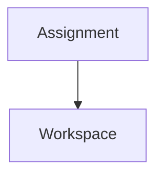

# Data API and Document Model

## 1. Database model baseline

### 1.1 `assignment_bank_items`

| Field | Purpose |
|---|---|
| id | Assignment bank item identifier |
| title | Assignment title |
| description | Assignment description |
| category | Assignment category |
| tags | Search/filter tags |
| difficulty | Difficulty level |
| created_by | Author/owner |
| latest_version_id | Latest assignment version pointer |
| created_at | Creation timestamp |
| updated_at | Update timestamp |

### 1.2 `assignment_bank_versions`

| Field | Purpose |
|---|---|
| id | Version identifier |
| bank_item_id | Parent bank item |
| version | Version label |
| repo_commit_hash | Git commit hash for version |
| change_summary | Human-readable change summary |
| rubric_snapshot | Rubric snapshot at this version |
| created_at | Creation timestamp |
| created_by | Version creator |

### 1.3 `assignment_instances`

| Field | Purpose |
|---|---|
| id | Assignment instance identifier |
| bank_item_id | Source assignment bank item |
| bank_version_id | Source assignment version |
| course_id | Course identifier |
| term | Academic term |
| section | Course section |
| current_assignment_version | Current release version |
| repo_url | Assignment instance repository URL |
| open_at | Opening timestamp |
| due_at | Due timestamp |
| status | Instance lifecycle status |

### 1.4 `student_workspaces`

| Field | Purpose |
|---|---|
| id | Student workspace identifier |
| assignment_instance_id | Assignment instance |
| student_id | Student identifier |
| repo_url | Student workspace repository URL |
| current_assignment_version | Current synchronized assignment version |
| current_commit_hash | Current workspace commit hash |
| sync_status | Sync status |
| created_at | Creation timestamp |
| updated_at | Update timestamp |

### 1.5 `submissions`

| Field | Purpose |
|---|---|
| id | Submission identifier |
| student_workspace_id | Source workspace |
| submitted_commit_hash | Submission commit hash |
| submitted_assignment_version | Assignment version submitted against |
| submitted_at | Submission timestamp |
| status | Submission status |
| score | Score/result summary |

### 1.6 `assignment_update_logs`

| Field | Purpose |
|---|---|
| id | Update log identifier |
| assignment_instance_id | Assignment instance |
| version | New version label |
| commit_hash | Assignment update commit hash |
| change_summary | Change summary |
| requires_ack | Whether student acknowledgement is required |
| created_at | Creation timestamp |

### 1.7 `workspace_sync_logs`

| Field | Purpose |
|---|---|
| id | Sync log identifier |
| student_workspace_id | Student workspace |
| assignment_update_id | Assignment update log |
| sync_status | Sync outcome |
| before_commit_hash | Workspace commit before sync |
| after_commit_hash | Workspace commit after sync |
| acknowledged_at | Student acknowledgement timestamp |

## 2. API design baseline

### Assignment APIs

```text
POST   /assignments
GET    /assignments
GET    /assignments/{id}
```

### Workspace APIs

```text
POST   /assignments/{id}/start
GET    /workspaces/{id}
PUT    /workspaces/{id}/document
POST   /workspaces/{id}/save
POST   /workspaces/{id}/submit
GET    /workspaces/{id}/history
```

### Synchronization APIs

```text
POST   /assignment-instances/{id}/publish-update
POST   /assignment-instances/{id}/sync-workspaces
GET    /workspaces/{id}/assignment-diff
POST   /workspaces/{id}/acknowledge-update
```

### Feedback APIs

```text
POST   /submissions/{id}/comments
GET    /submissions/{id}/comments
```

## 3. Document model

### Editor JSON

```json
{
  "blocks": []
}
```

Editor blocks may include paragraph, heading, code, table, image, reference, and graph/diagram blocks. Graph/table/image blocks must preserve source data, fallback text or snapshot metadata, and export/evidence behavior.

### Markdown export

```markdown
# Assignment Title

Content...



| Item | Evidence |
|---|---|
| Table | Preserved in Markdown/export |

Image block: alt="Alt text", src="relative/path/to/example.png"
```

## 4. Automatic validation

Supported checks:

- minimum length;
- required sections;
- image existence;
- table existence;
- graph/diagram source validity where configured;
- reference existence;
- submission deadline;
- empty section detection.

## 5. Recommended tech stack from prior design

| Layer | Candidate stack |
|---|---|
| Backend | FastAPI, PostgreSQL, Redis, Celery, GitPython or pygit2 |
| UI/rendering | Fast controlled desktop/platform-specific UI; exact toolkit/editor/rendering component to be selected. Next.js or web UI technology is conditionally allowed if rendering, evidence, offline, role, and performance gates pass. |
| Storage | Local Git repositories, MinIO or S3-compatible storage |

## 6. Controlled UI and rendering baseline

Next.js is conditionally acceptable again as a UI/application layer if it remains inside the controlled desktop or platform-specific product boundary and passes the rendering/evidence contract. The implementation shall not depend on remote-only rendering for normal assignment review.

- The document-first/Notion-style behavior remains required regardless of native or web UI technology.
- Git synchronization, validation, submission, and evaluation-trigger operations shall run as asynchronous background jobs with visible progress/error reporting.
- Large lists, submissions, logs, and diffs shall use virtualized or incremental rendering.
- FastAPI may remain only as an internal/local application-service boundary if packaging, security, and performance review accept it.
- The exact UI toolkit remains a focused design question: WinUI 3/.NET, WPF/.NET, Qt, Avalonia, Next.js inside a desktop shell, or another efficient toolkit.
- Graph, table, and image rendering shall be treated as first-class capability, not cosmetic Markdown decoration. See [Graph table image rendering profile](graph-table-image-rendering-profile.md) and [Rendering engine strategy](rendering-engine-strategy.md).

See [Fast native desktop UI baseline](fast-native-desktop-ui-baseline.md).

## 7. Core modules

- Problem Bank Manager
- Assignment Instance Manager
- Student Workspace Manager
- Git Synchronization Engine
- Submission Manager
- Diff Viewer
- Conflict Detector
- Notification System
- Rubric Evaluator
- Feedback Manager

## 8. Final design principles

| Area | Principle |
|---|---|
| Assignment original | Centrally managed and read-only to students |
| Student workspace | Isolated editable environment and independently version controlled |
| Submission | Committed to assignment instance submission branch |
| Assignment updates | Synchronized automatically while preserving workspace |
| Evaluation | Based on submission snapshot plus assignment version |

## Student knowledge and export data model extension

Additional controlled entities:

| Entity | Purpose |
|---|---|
| `assignment_execution_blocks` | Structured Notion-style blocks for planning, code explanation, table, graph, image, checklist, decision, experiment, and reflection. |
| `student_student_knowledge_notes` | Student-owned knowledge notes linked to assignment, code, experiment, reference, or reflection records. |
| `student_knowledge_links` | Backlinks/relationships among notes, code files, submissions, experiments, and references. |
| `report_templates` | Instructor/course templates mapping blocks and knowledge artifacts to report sections. |
| `export_manifests` | Derived output trace records for DOCX/HWP/HWPX/PDF/Markdown exports. |

Export APIs must never treat DOCX/HWP as authoritative source. They produce derived artifacts linked to source commit SHA and export manifest.

## Editor requirements extension

The editor model is now a controlled product capability. Add or refine these entities:

| Entity | Purpose |
|---|---|
| `editor_documents` | Stable document record for assignment brief, student workspace document, knowledge note, report template, or feedback note. |
| `editor_blocks` | Normalized block records with block ID, type, parent/order, schema version, source payload, validation state, and export mapping. |
| `editor_checkpoints` | Autosave/checkpoint records linked to Git commit SHA, actor, timestamp, path scope, and recovery metadata. |
| `editor_validation_results` | Required block, citation, asset, privacy, deadline, export, and academic-integrity validation findings. |
| `editor_export_bindings` | Mapping from editor blocks to Markdown/DOCX/HWP/HWPX/PDF report sections. |

Additional editor APIs:

```text
GET    /editor/documents/{id}
PATCH  /editor/documents/{id}/blocks
POST   /editor/documents/{id}/autosave
POST   /editor/documents/{id}/checkpoint
GET    /editor/documents/{id}/history
POST   /editor/documents/{id}/validate
POST   /editor/documents/{id}/export-preview
POST   /editor/documents/{id}/recover
```

Editor APIs must enforce role/path/scope authorization at the backend/application service boundary and must not rely only on UI hiding.

See [Notion-style editing requirements profile](notion-style-editing-requirements-profile.md).

## 9. Gap-closure data model additions

| Entity | Purpose |
|---|---|
| `knowledge_artifacts` | Student-owned notes, decisions, experiments, references, and index records with privacy class |
| `knowledge_submission_links` | Selected or required knowledge artifacts included in a submission snapshot |
| `editor_block_documents` | Canonical block-schema document envelopes independent of editor internals |
| `editor_block_index` | Rebuildable current block lookup for rendering/search/validation; canonical state remains in JSON snapshots |
| `export_fidelity_records` | Loss/warning records per derived output and block ID |
| `evaluation_runner_profiles` | Official/advisory runner profile, sandbox/resource limits, toolchain metadata |
| `state_transition_records` | Student lifecycle, submission, and assignment-release state transitions |
| `roster_import_records` | CSV/JSON import hash, encoding, accepted/rejected rows, privacy flags |
| `github_operation_records` | GitHub API dry-run/live operation, token reference, rate-limit and retry evidence |
| `performance_measurements` | P50/P95 fixture measurements with hardware/profile context |

These entities trace to [Editor block schema baseline](block-schema.md), [Knowledge topology and submission policy](knowledge-topology-submission-policy.md), [Export fidelity acceptance criteria](export-fidelity-acceptance.md), [Evaluation execution profile](evaluation-execution-profile.md), and [Performance budget](performance-budget.md).

## 10. Notion-style storage data structures

EduOps shall persist Notion-style documents through the hybrid model in [Notion-style document storage architecture](notion-style-document-storage-architecture.md).

| Entity/index | Purpose | Canonical? |
|---|---|---|
| `editor_document_snapshots` | Materialized canonical JSON document snapshots with schema/storage version and hashes | Yes |
| `editor_markdown_projections` | Deterministic Markdown projection path, hash, and projection profile | Yes |
| `editor_operation_journal` | Incremental edit operations for autosave/recovery/undo/redo | Local durable; checkpoint-linked |
| `editor_revision_graph` | Base/current revision, parent revision, Git checkpoint, operation range | Yes for checkpointed revisions |
| `editor_block_index` | Fast current block lookup/search/render/validation index | Rebuildable |
| `editor_asset_refs` | Content-addressed assets, media type, privacy class, alt text, hash | Yes when referenced by canonical document |
| `editor_conflict_records` | Assignment update/offline/Git/export conflicts affecting block IDs | Audit/evidence when unresolved or submitted |
| `editor_search_index` | Full-text and backlink search | Rebuildable |

Save APIs shall append an operation, update local indexes, periodically materialize canonical JSON and Markdown, and create Git checkpoints at explicit boundaries such as save, submit, export, assignment acknowledgement, feedback release, or recovery.

## 11. Storage refinement: projection, identity, and migration

| Entity/index | Purpose | Canonical? |
|---|---|---|
| `editor_projection_manifests` | Projection profile, JSON hash, Markdown hash, lossy/fallback block warnings, asset hashes | Yes |
| `editor_block_lineage` | Clone/split/merge/tombstone relationships across assignment templates, workspaces, knowledge notes, and submissions | Yes when checkpointed |
| `editor_schema_migrations` | Migration input/output schema, hashes, actor/tool, result, quarantine state | Yes |
| `editor_tombstones` | Deleted block metadata and retention/evidence state | Yes for evidence-bearing deletions |
| `editor_asset_privacy` | Asset privacy class, LFS/remote eligibility, redaction/export state | Yes when referenced |

`editor_blocks` names normalized block records in canonical snapshots or normalized tables. `editor_block_index` names rebuildable local lookup/search/render state and shall not be treated as canonical evidence.
